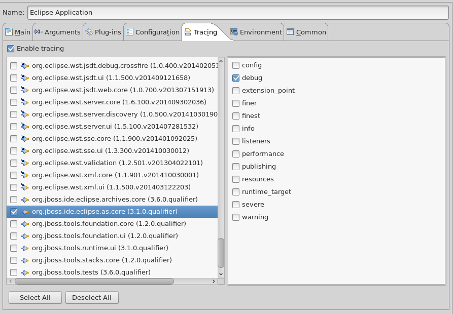
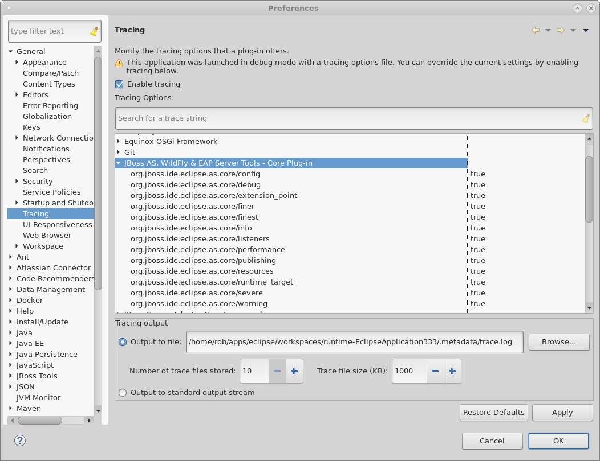

== Foundation

The link:https://github.com/jbosstools/jbosstools-base/[`jbosstools-base`] repository includes our link:https://github.com/jbosstools/jbosstools-base/blob/master/foundation/[`foundation`] module, which is our lowest level module and is used for setting up boiler-plate infrastructure for
your plugin to make use of. This module contains  several base classes that are extremely useful for setting up your new plugin. These classes are in the
`org.jboss.tools.foundation.core` and `org.jboss.tools.foundation.ui` plugins. They help plugin developers quickly gain access to:

- Status object creation
- Logging of messages
- Tracing
- Shared Images

A great example of plugins that already use these classes can be found at link:https://github.com/jbosstools/jbosstools-base/blob/master/stacks/plugins/org.jboss.tools.stacks.core/src/org/jboss/tools/stacks/core/StacksCoreActivator.java[StacksCoreActivator] for the Core case, 
and link:https://github.com/jbosstools/jbosstools-base/blob/master/runtime/plugins/org.jboss.tools.runtime.ui/src/org/jboss/tools/runtime/ui/RuntimeSharedImages.java[RuntimeSharedImages] for an example of our Shared Images functionality. 

=== The Activators

There are two notable superclasses for a new plugin's activator class. They are `org.jboss.tools.foundation.core.plugin.BaseCorePlugin` and `org.jboss.tools.foundation.ui.plugin.BaseUIPlugin`. 
A new plugin should extend one of these two classes in almost all cases unless prevented by other architectural concerns. 

`BaseCorePlugin` and `BaseUIActivator` grant access to several very useful APIs. See the three following protected methods:

```
protected IPluginLog pluginLogInternal()        // To easily log messages
protected StatusFactory statusFactoryInternal() // To create status objects
protected void registerDebugOptionsListener(String pluginId, AbstractTrace trace, BundleContext bc) // To aid in tracing
```

Since these three methods are all protected, they are not callable from outside the class heirarchy. 
A new plugin's activator should expose the plugin log and the status factory methods in whatever way
they decide is best. Most often, with the goal of concise code for callers, a plugin activator 
would probably expose these methods as static methods as follows:

```
	public static IPluginLog pluginLog() {
		return getDefault().pluginLogInternal();
	}
	public static StatusFactory statusFactory() {
		return getDefault().statusFactoryInternal();
	}
```

== Tracing

Tracing is a mechanism provided by eclipse to help log a subset of messages based on various keys. It is very useful when debugging, because you can 
select which types of messages you want logged. In runtime-workbench, you can accomplish this via UI, and in a full installation, you can enable this
by using a .options file in your eclipse installation's root folder. 

For some information on eclipse tracing, see https://wiki.eclipse.org/FAQ_How_do_I_use_the_platform_debug_tracing_facility

In `foundation`, however, we provide a base class `AbstractTrace` which you should extend, as well as a method to assist in wiring up the tracing. 

=== Your Trace Class

At a minimum, your Trace class should look as follows:

```
import org.eclipse.osgi.service.debug.DebugOptions;
import org.eclipse.osgi.service.debug.DebugOptionsListener;
import org.jboss.tools.foundation.core.plugin.AbstractTrace;
import org.jboss.tools.your.plugin.YourPluginActivator;

public class Trace extends AbstractTrace implements DebugOptionsListener {
	private static Trace instance = null;
	public Trace(YourPluginActivator p) {
		super(p);
		instance = this;
	}

	public static void trace(final String level, String s) {
		trace(level, s, null);
	}

	public static void trace(final String level, String s, Throwable t) {
		traceInternal(instance, level, s, t);
	}
}
```

This allows very concise call methods later, where you can simply call

    Trace.trace(Trace.STRING_EXTENSION_POINT, "Loading some ext. pt");

The abstract super class includes several useful pre-defined trace constants: `finest`, `finer`, `info`, `warning`, and `severe`. These are simply `levels`, as opposed to `categories`. Developers should trace using `finest` for the absolute greatest detail, `finer` for things one step higher, `info` for things more notable, `warning` for things that may cause problems, and `severe` for big or unexpected problems.

Anything traced with `severe` will automatically be added to the error log. 

```
	public final static String STRING_CONFIG = "/config"; //$NON-NLS-1$
	public final static String STRING_INFO = "/info"; //$NON-NLS-1$
	public final static String STRING_WARNING = "/warning"; //$NON-NLS-1$
	public final static String STRING_SEVERE = "/severe"; //$NON-NLS-1$
	public final static String STRING_FINER = "/finer"; //$NON-NLS-1$
	public final static String STRING_FINEST = "/finest"; //$NON-NLS-1$
	public final static String STRING_RESOURCES = "/resources"; //$NON-NLS-1$
	public final static String STRING_EXTENSION_POINT = "/extension_point"; //$NON-NLS-1$
	public final static String STRING_LISTENERS = "/listeners"; //$NON-NLS-1$
```

These constants come in two forms. One form is your typical logging levels. These levels would be used in most of your codebase. Depending on how much detail you wish to log, you would trace using one of `severe`, `warning`, `info`, `finer`, and `finest`.

The second form used in constants are more like categories. You would use these logging levels for what are essentially logging categories; things like listeners, extension points, or access to workspace resources.

To add your own constant for a category named `remote`, you can add the following logic:

```
	public static final String STRING_REMOTE_CALL = "/remote"; //$NON-NLS-1$

	protected void createDefaultDebugSettings() {
		super.createDefaultDebugSettings();
		getOptionsMap().put(STRING_REMOTE_CALL, new Boolean(false));
	}
	public void optionsChanged(DebugOptions options) {
		super.optionsChanged(options);
		String pid = plugin.getBundle().getSymbolicName();
		getOptionsMap().put(STRING_REMOTE_CALL, options.getBooleanOption(pid + STRING_REMOTE_CALL, false));
	}
```

=== The .options file

To expose all your constants so that the Eclipse launch framework can see them, your plugin will also need a `.options` file placed in the root of your plugin. Depending on what constants you declare, it would look something like this:

```
# Debugging options for the org.jboss.ide.eclipse.as.core plugin

# Turn on general debugging
org.jboss.ide.eclipse.as.core/debug=true

# Tracing options
org.jboss.ide.eclipse.as.core/config=false
org.jboss.ide.eclipse.as.core/info=false
org.jboss.ide.eclipse.as.core/warning=false
org.jboss.ide.eclipse.as.core/severe=false
org.jboss.ide.eclipse.as.core/finest=false
org.jboss.ide.eclipse.as.core/finer=false

# Tracking of server resources
org.jboss.ide.eclipse.as.core/resources=false

# Loading of extension points
org.jboss.ide.eclipse.as.core/extension_point=false

# Server listeners
org.jboss.ide.eclipse.as.core/listeners=false

# runtime targets
org.jboss.ide.eclipse.as.core/runtime_target=false

# Performance of loading and calling delegates
org.jboss.ide.eclipse.as.core/performance=false

# Publishing
org.jboss.ide.eclipse.as.core/publishing=false

```

To verify that these are all now visible in Eclipse UI when launching your plugin in runtime workbench, you should open your debug launch configuration, and go to the `Tracing` tab. You'll see something similar to this:



Once performing these tasks, your new trace type should be available to be used either in another `.options` file when running eclipse, or via Eclipse UI for launching via Runtime Workbench. 

=== User-visible Tracing Options

A user can enable these tracing options, but it's a bit complicated. They need to create a .options file, add all the tracing flags, and then launch eclipse with the '-debug' flag. 

However, a user can do it through the general eclipse UI, in the 'Tracing' preference page, if your UI plugin makes use of the tracing extension point. 

```
	<extension point="org.eclipse.ui.trace.traceComponents">
		<component id="org.jboss.ide.eclipse.as.core" label="JBoss AS, WildFly &amp; EAP Server Tools - Core Plug-in">
			<bundle consumed="true" name="org.jboss.ide.eclipse.as.core"/>
		</component>
		<component id="org.jboss.ide.eclipse.as.wtp.core" label="JBoss Server Adapter Core Framework">
			<bundle consumed="true" name="org.jboss.ide.eclipse.as.wtp.core"/>
		</component>
	</extension>
```


== Shared Images

`BaseUIPlugin` in the `org.jboss.tools.foundation.ui` plugin provides infrastructure to help you share images for your various UI wizards, views, and preference pages. 
For an example of a class that already extends the shared images, you could look at link:https://github.com/jbosstools/jbosstools-base/blob/master/runtime/plugins/org.jboss.tools.runtime.ui/src/org/jboss/tools/runtime/ui/RuntimeSharedImages.java[RuntimeSharedImages]

To begin, your subclass of `BaseUIPlugin` would override the `createSharedImages` method as follows:

```
	public static final String CAMEL_IMG = "icons/camel.gif";
	protected BaseUISharedImages createSharedImages() {
		return new CamelSharedImages(getBundle());
	}
	
	private static class CamelSharedImages extends BaseUISharedImages {
		public CamelSharedImages(Bundle pluginBundle) {
			super(pluginBundle);
			addImage(CAMEL_IMG, CAMEL_IMG);
		}
	}
```

In the above case, we override `createSharedImages` to return our own subclass of `BaseUISharedImages` and 
add an image to it. Your plugin should have a folder named `icons` in its root, with a `camel.gif` inside that folder. 
Your client code could then access these images by calling:

    Image i = MyPlugin.getSharedImages().image(MyPlugin.CAMEL_IMG);
    ImageDescriptor id = MyPlugin.getSharedImages().descriptor(MyPlugin.CAMEL_IMG);

== Conclusion

Using the above APIs simplify creating status objects, logging errors or warnings, accessing shared images, and tracing low-level debug messaging. We highly suggest you use these APIs when creating new plugins. 
