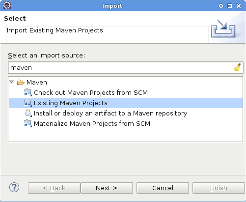
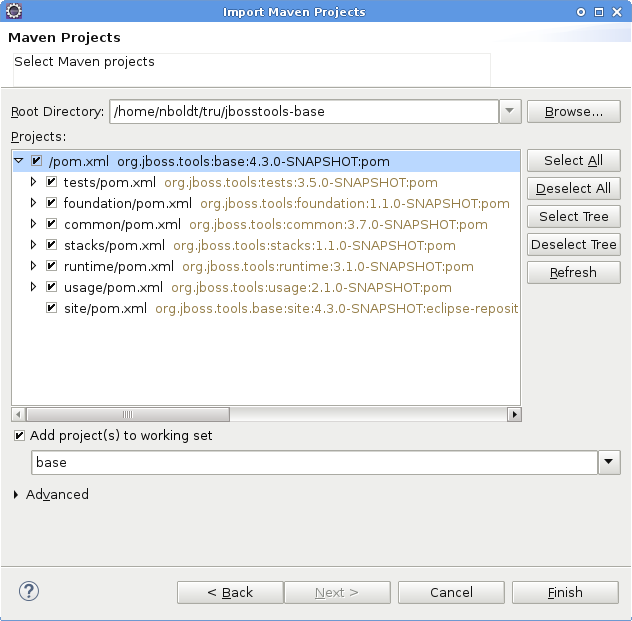
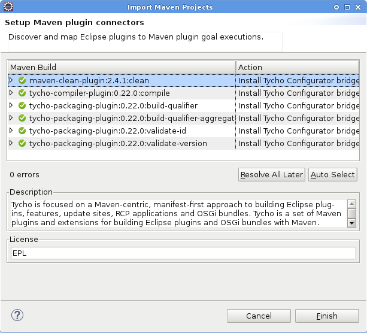
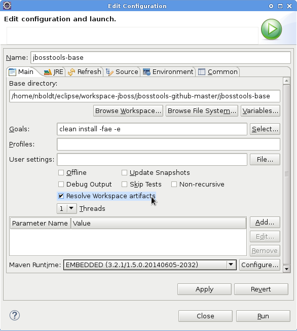
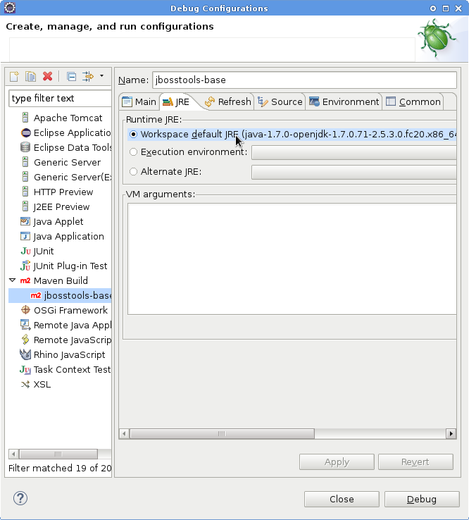
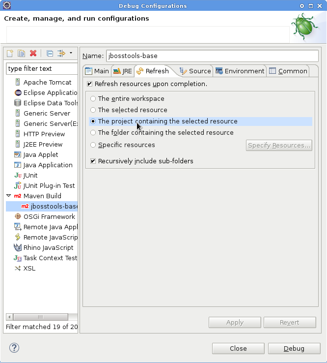
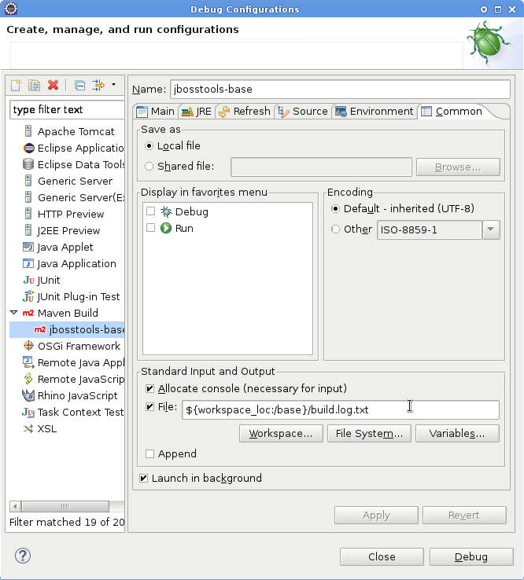
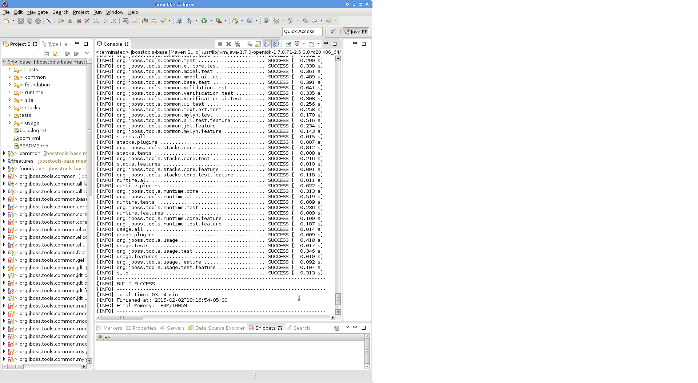

#  Building locally in Eclipse

First, fetch the sources of the project you want to build from Github. For details, see link:configuring_git_workflow.adoc#Sources[Configuring Git Workflow - Sources].

Launch Eclipse, then select `File -> Import -> Maven -> Existing Maven Projects`

Browse for where you cloned the repo with which you want to work.

Some projects require a full Maven build before they will compile properly in Eclipse with PDE. To solve this problem, you can either build using Maven via the commandline, or configure Eclipse to use m2e and Tycho to build the project instead of PDE. The import wizard will do this for you automatically.

image::../images/import-maven-project-4-tycho.png[]

Note that the Tycho configurator also includes PDE, so that it can be installed even if you're using a version of Eclipse which doesn't already include it.

image::../images/import-maven-project-5-tycho-pde.png[]

Once the project(s) are imported, you'll want to build them. Eclipse will do this automatically with PDE, but if you want to explicitly launch Maven to perform a build, you can do so as well.

You can either do `CTRL-SHIFT-X,M` (Run Maven Build), or right-click the project and select Run As > Maven Build. 

On the _Main_ tab, set a `Name` and enter `clean install -fae -e` in the Goals line. 

You can also add `-DskipTests` if you wanted build but not run your tests - or just check the `Skip Tests` checkbox.

Be sure to check `Resolve Workspace` artifacts, and, if you have a newer version of Maven installed, point your build at that `Maven Runtime` instead of the bundled one that ships with m2eclipse.

On the _JRE_ tab, make sure you're using JDK 7 or higher.

On the _Refresh_ tab, define which workspace resources you want to refresh when the build's done.

On the _Common_ tab, you can store the output of the build in a log file in case it's particularly long and you need to refer back to it.

Click _Run_ to run the build.

Now you can repeat the above step to build any other component or plugin or feature or update site from the JBoss Tools repos. Simply import the project(s) and build them as above. 

## More info

To build on the commandline, see link:build_from_commandline.adoc[Building locally via commandline]

See also link:build_options.adoc[build options]. 