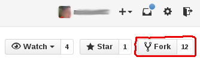
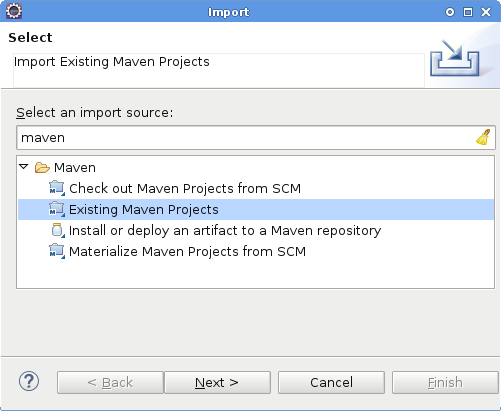
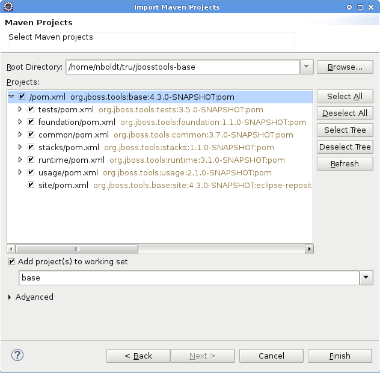
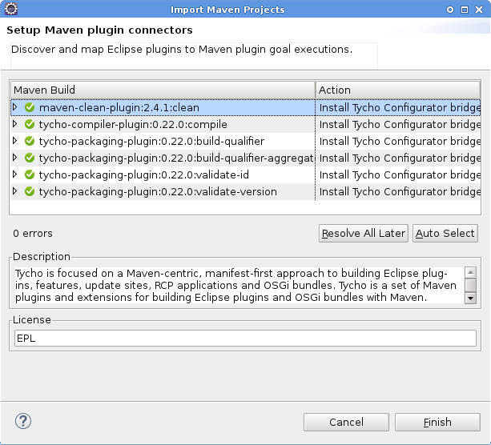
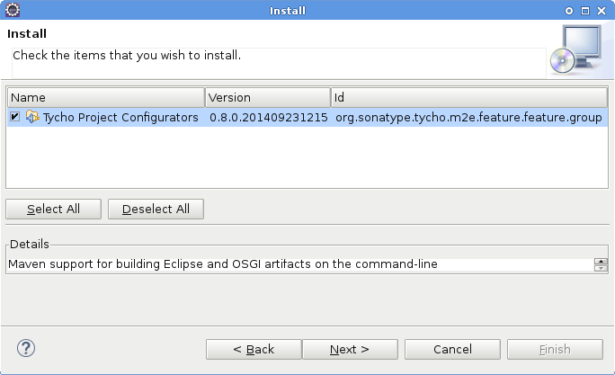
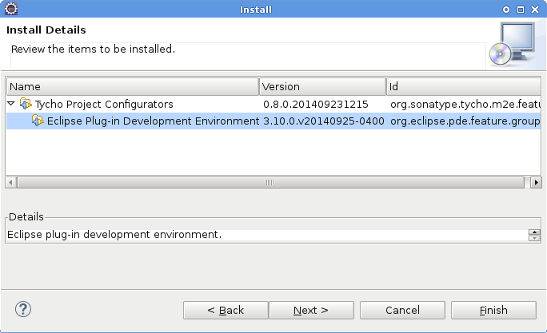

= Configuring Git Workflow

== How to setup git locally

See http://git-scm.com/book/en/v2/Getting-Started-Installing-Git[Getting Started Installing Git]

=== Setting up your ~/.gitconfig 

In order to have patches accepted, you should first declare your identity by 
modifying your `~/.gitconfig` file to add the following:

[source,bash]
----
[user]
        name = Your Name
        email = yourname@example.com
----

==== Useful aliases for the ~/.gitconfig

Here are some aliases you can add to your `~/.gitconfig` file, in the `[alias]` section. 

The first two aliases (`lg` and `lg1`) assist you in browsing the commit log. 
After adding them to your .gitconfig file, you can test them out by typing `git lg 5`, 
which means show the past 5 commits in a nice pretty format. 

The third alias, `ch`, allows you to rebase the last `n` commits, and to either 
modify the commit messages, squash the entries, re-order entries, and other functions native to git. 

[source,bash]
----
[alias]
  lg = log --graph --pretty=format:'%Cred%h%Creset -%C(yellow)%d%Creset %s %C(blue)%aE%Creset %Cgreen(%cr)%Creset' --abbrev-commit --date=relative
  lgl = log --graph --pretty=format:'%Cred%h%Creset -%C(yellow)%d%Creset %s \n\t\t\t%C(blue)%aN %aE, %cN %cE%Creset %Cgreen(%cD - %cr)%Creset' --abbrev-commit --date=relative
  ch = "!sh -c 'git rebase -i HEAD~$1' -"
----

You can also configure default diff and merge editors. In the example below, Sublime Text is selected as the diff/merge editor, and Beyond Compare is used for performing graphical comparisons, eg., with `git difftool` or `git mergetool`.

[source,bash]
----
[diff]
  editor = /opt/sublimetext2/sublime_text
  tool = bc3

[merge]
  editor = /opt/sublimetext2/sublime_text
  tool = bc3
----

=== Useful bash scripts

The following bash function will help you quickly identify when you are inside a folder
that is recognized as a git repository.  It will customize your bash prompt to include 
the repository name and the current branch. 

[source,bash] 
----
# returns the branch name
__git_ps1 ()
{
  local b="$(git symbolic-ref HEAD 2>/dev/null)";
  if [ -n "$b" ]; then
    printf " (%s)" "${b##refs/heads/}";
  fi
}
export PS1='[\u@\h \W] $(__git_ps1 "(%s)")$'

# this may also be required for your distro
PROMPT_COMMAND=__git_ps1
----

Now when in a git folder, your bash prompt will look as follows:

[source,bash] 
----
[user@localhost jbosstools-server]  (master) $
----

== Sources

=== How to clone a repo to fetch sources

To fetch sources, you must clone the repo to your local disk.

[source,bash]
----
cd ~/my-github-stuff
git clone git@github.com:jbosstools/jbosstools-base.git
cd jbosstools-base
----

See also http://git-scm.com/book/en/v2/Git-Basics-Getting-a-Git-Repository#Cloning-an-Existing-Repository[Cloning an Existing Repository]

Then, if you plan to contribute a pull request, you will need your own fork. To fork the repo, 
browse to the repo on github, and click the `Fork` button in the top-right corner.

=== How to import projects into Eclipse

Launch Eclipse, then select `File -> Import -> Maven -> Existing Maven Projects`

Browse for where you cloned the repo with which you want to work.

Some projects require a full Maven build before they will compile properly in Eclipse with PDE. To solve this problem, you can either build using Maven via the commandline, or configure Eclipse to use m2e and Tycho to build the project instead of PDE. The import wizard will do this for you automatically.

Note that the Tycho configurator also includes PDE, so that it can be installed even if you're using a version of Eclipse which doesn't already include it.

=== How to add forks to your local clone

If you use https://hub.github.com/[hub], you can simply add a fork like this:

[source,bash]
----
cd ~/my-github-stuff/jbosstools-base
git remote add -p ${gituser}
----

Or, without https://hub.github.com/[hub], do this:

[source,bash]
----
cd ~/my-github-stuff/jbosstools-base
git remote add ${gituser} git@github.com:${gituser}/jbosstools-base.git
----

Then to check which forks you have attached:

[source,bash]
----
git remove -v

nickboldt   git@github.com:nickboldt/jbosstools-devdoc.git (fetch)
nickboldt   git@github.com:nickboldt/jbosstools-devdoc.git (push)
origin  git@github.com:jbosstools/jbosstools-devdoc.git (fetch)
origin  git@github.com:jbosstools/jbosstools-devdoc.git (push)
----

== Submitting Pull Requests as a Contributor

It is recommended that you use https://hub.github.com/[hub] to simplify your commandline git experience.

To install hub, go here: https://hub.github.com/

=== Pull Request Guidelines

The rules are simple:

. Ensure you've pulled the latest from the upstream origin's fork and topic branch
. Rebase/merge as needed
. Topic branch should contain JIRA ID
. Commit comment(s) should also contain JIRA ID

[source,bash]
----
# checkout the topic branch and origin branch, and link them
# ${topic} = topic branch in your fork
# ${branch} = branch in the origin
git checkout origin/${branch} -b ${topic}
git checkout ${topic}

# commit changes
git commit -m "JBIDE-12345 fix that thing that was broken" somefile
git commit -m "JBIDE-12345 additional fix" somefile
git commit -m "typo" somefile

# squash commits?
git rebase -i HEAD~3 # eg., if you want to squash 3 commits into a single one

# rebase your changes against the origin
git pull --rebase origin ${branch}

# push to your fork
# ${gituser} is your username at github
git push ${gituser} ${topic}

# create pull request
# if you use hub (see `Submitting Patches` above), you can create a pull request via commandline:
parentProject=`git remote -v | grep origin | grep push | sed "s/.\+github.com\(:\|\/\)\(.\+\)\/.\+/\2/"`
hub pull-request -o -f -m "`git log -1 --pretty=%B` >> ${branch}" -b ${parentProject}:${branch} -h ${gituser}:${topic}
----

== Accepting Patches (Maintainers)

TODO: write this section

=== How to merge a pull request correctly
=== When to use merge commits
=== When to squash commits
=== How to keep you local git clone clean (eg., deleting local patch branches after merging)
