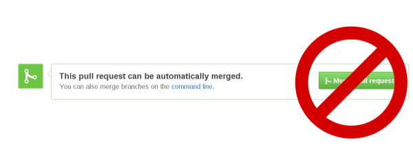

= Configuring Git Workflow

== How to setup git locally

The process for setting up git varies based on your operating system. See http://git-scm.com/book/en/v2/Getting-Started-Installing-Git[Getting Started Installing Git] for more information. Once git is installed, continue with the steps below. 

=== Setting up your ~/.gitconfig 

In order to have patches accepted, you should first declare your identity by 
modifying your `~/.gitconfig` file to add the following:

[source,bash]
----
[user]
        name = Your Name
        email = yourname@example.com
----

==== Useful aliases for the ~/.gitconfig

Here are some aliases you can add to your `~/.gitconfig` file, in the `[alias]` section. 

The first two aliases (`lg` and `lg1`) assist you in browsing the commit log. 
After adding them to your .gitconfig file, you can test them out by typing `git lg 5`, 
which means show the past 5 commits in a nice pretty format. 

The third alias, `ch`, allows you to rebase the last `n` commits, and to either 
modify the commit messages, squash the entries, re-order entries, and other functions native to git. 

[source,bash]
----
[alias]
  lg = log --graph --pretty=format:'%Cred%h%Creset -%C(yellow)%d%Creset %s %C(blue)%aE%Creset %Cgreen(%cr)%Creset' --abbrev-commit --date=relative
  lgl = log --graph --pretty=format:'%Cred%h%Creset -%C(yellow)%d%Creset %s \n\t\t\t%C(blue)%aN %aE, %cN %cE%Creset %Cgreen(%cD - %cr)%Creset' --abbrev-commit --date=relative
  ch = "!sh -c 'git rebase -i HEAD~$1' -"
----

You can also configure default diff and merge editors. In the example below, Sublime Text is selected as the diff/merge editor, and Beyond Compare is used for performing graphical comparisons, eg., with `git difftool` or `git mergetool`.

[source,bash]
----
[diff]
  editor = /opt/sublimetext2/sublime_text
  tool = bc3

[merge]
  editor = /opt/sublimetext2/sublime_text
  tool = bc3
----

=== Useful bash scripts

The following bash function will help you quickly identify when you are inside a folder
that is recognized as a git repository.  It will customize your bash prompt to include 
the repository name and the current branch. 

[source,bash] 
----
# returns the branch name
__git_ps1 ()
{
  local b="$(git symbolic-ref HEAD 2>/dev/null)";
  if [ -n "$b" ]; then
    printf " (%s)" "${b##refs/heads/}";
  fi
}
export PS1='[\u@\h \W] $(__git_ps1 "(%s)")$'

# this may also be required for your distro
PROMPT_COMMAND=__git_ps1
----

Now when in a git folder, your bash prompt will look as follows:

[source,bash] 
----
[user@localhost jbosstools-server]  (master) $
----

== Sources

=== How to clone a repo to fetch sources

To fetch sources, you must clone the repo to your local disk.

[source,bash]
----
cd ~/my-github-stuff
git clone git@github.com:jbosstools/jbosstools-base.git
cd jbosstools-base
----

See also http://git-scm.com/book/en/v2/Git-Basics-Getting-a-Git-Repository#Cloning-an-Existing-Repository[Cloning an Existing Repository]

Then, if you plan to contribute a pull request, you will need your own fork. To fork the repo, 
browse to the repo on github, and click the `Fork` button in the top-right corner.

image::../images/fork-a-repo.png[Fork a github repo]

=== How to import projects into Eclipse

Launch Eclipse, then select `File -> Import -> Maven -> Existing Maven Projects`

image::../images/import-maven-project.png[]

Browse for where you cloned the repo with which you want to work.

image::../images/import-maven-project-2.png[]

Some projects require a full Maven build before they will compile properly in Eclipse with PDE. To solve this problem, you can either build using Maven via the commandline, or configure Eclipse to use m2e and Tycho to build the project instead of PDE. The import wizard will do this for you automatically.

image::../images/import-maven-project-3-tycho.png[]
image::../images/import-maven-project-4-tycho.png[]

Note that the Tycho configurator also includes PDE, so that it can be installed even if you're using a version of Eclipse which doesn't already include it.

image::../images/import-maven-project-5-tycho-pde.png[]

=== How to add forks to your local clone

If you use https://hub.github.com/[hub], you can simply add a fork like this:

[source,bash]
----
cd ~/my-github-stuff/jbosstools-base
git remote add -p ${gituser}
----

Or, without https://hub.github.com/[hub], do this:

[source,bash]
----
cd ~/my-github-stuff/jbosstools-base
git remote add ${gituser} git@github.com:${gituser}/jbosstools-base.git
----

Then to check which forks you have attached:

[source,bash]
----
git remove -v

nickboldt   git@github.com:nickboldt/jbosstools-devdoc.git (fetch)
nickboldt   git@github.com:nickboldt/jbosstools-devdoc.git (push)
origin  git@github.com:jbosstools/jbosstools-devdoc.git (fetch)
origin  git@github.com:jbosstools/jbosstools-devdoc.git (push)
----


== Submitting Pull Requests as a Contributor

It is recommended that you use https://hub.github.com/[hub] to simplify your commandline git experience.

To install hub, go here: https://hub.github.com/

=== Pull Request Guidelines

The rules are simple:

. Ensure you've pulled the latest from the upstream origin's fork and topic branch
. Rebase/merge as needed
. Topic branch should contain JIRA ID
. Commit comment(s) should also contain JIRA ID

[source,bash]
----
# checkout the topic branch and origin branch, and link them
# ${topic} = topic branch in your fork
# ${branch} = branch in the origin
git checkout origin/${branch} -b ${topic}
git checkout ${topic}

# commit changes
git commit -m "JBIDE-12345 fix that thing that was broken" somefile
git commit -m "JBIDE-12345 additional fix" somefile
git commit -m "typo" somefile

# squash commits?
git rebase -i HEAD~3 # eg., if you want to squash 3 commits into a single one

# rebase your changes against the origin
git pull --rebase origin ${branch}

# push to your fork
# ${gituser} is your username at github
git push ${gituser} ${topic}

# create pull request
# if you use hub (see `Submitting Patches` above), you can create a pull request via commandline:
parentProject=`git remote -v | grep origin | grep push | sed "s/.\+github.com\(:\|\/\)\(.\+\)\/.\+/\2/"`
hub pull-request -o -f -m "`git log -1 --pretty=%B` >> ${branch}" -b ${parentProject}:${branch} -h ${gituser}:${topic}
----

== Accepting Patches (Maintainers)

Maintainers and committers are required to do due dilligence on any patches that come their way. 
This includes an initial *code review* to catch any obvious problems, as well as *smoke tests*.
Maintainers may require patches come with *unit tests* as well, so they can easily verify that the
given patch does in fact fix the given issue. 

To check out a given contribution and run the tests or manually smoke-test the contribution, 
maintainers should look at the pull request to determine 
the contributor's GitHub username, as well as the topic branch. 

```bash
cd jbosstools-server
git remote add exampleuser git@github.com:exampleuser/jbosstools-server.git
git fetch exampleuser
git checkout prtopicbranch
```  

At this point, the maintainer should either run the modified source in the Eclipse Runtime Workbench (link TODO) or 
run the build via command line (link TODO) to verify the unit tests all pass. 

Once the patch is verified as correct and acceptable, the committer should then merge the pull request in 
a neat and orderly fashion, which is the topic we will cover next. 

=== How to merge a pull request correctly

*Do NOT click the big green button!*



In order to keep an orderly git commit log history, JBoss Tools generally prefers clean
merges to using the automatic merge ability provided by GitHub. What this means in principle
is that we generally prefer to `squash` our commits, `rebase` against the most recent commits, 
and end up with one commit per issue. 

If, for example, you or a contributor was working in a topic branch to solve JBIDE-99999, 
and 4 commits were made in the process, the following steps would need to be performed. 
For this example, let's assume that the given pull request is intended to be pushed to master. 

```
git fetch contributorid
git checkout topicbranch
git rebase master     # This ensures all interim commits are placed before us

# This allows us to squash, re-order, or otherwise modify our commits during the rebase, squash the last 3 commits into the first
git rebase -i HEAD~5  
# Modify the commit message to be as clear as possible and remove crud or irrelevent / outdated comments
# Complete the squash by changing 'pick' to 'squash' for the bottom 3 commits

pick 5125930 - JBIDE-99992 reference to configuring dev-env
pick 459fd64 - JBIDE-99999 Fixed one NPE, but issue still present
squash df36ad5 - JBIDE-99999 Added test case
squash 50ecaee - JBIDE-99999 Added sysouts to aid in debugging
squash 236f476 - JBIDE-99999 Fixed core issue, deleted all temporary sysouts

# Complete your squash by saving the editor
git checkout master
git merge topicbranch
git push origin master
```

=== When to squash commits
The answer here is "almost always". In general, we prefer to target 1 commit for each jira issue. If it took five commits to 
figure out the answer and get it working properly, those five should generally be squashed into one commit. 

In practice, this will change your commit log from

```
* 236f476 - JBIDE-99999 Fixed core issue, deleted all temporary sysouts
* 50ecaee - JBIDE-99999 Added sysouts to aid in debugging
* df36ad5 - JBIDE-99999 Added test case
* 459fd64 - JBIDE-99999 Fixed one NPE, but issue still present
* 5125930 - JBIDE-99992 reference to configuring dev-env
```

To...


```
* 880fd31 - JBIDE-99999 Fixed core issue, two NPE's, and added a test
* 5125930 - JBIDE-99992 reference to configuring dev-env (2 days ago, Rob Stryker)
```

=== When to use merge commits

Merge commits are acceptable for a very few situations. The main one is if 
some large refactor is progressing in a topic branch that wouldn't make sense
to be squashed into one commit because of the loss of history details. 

In general, even when using a merge commit, it is still better to rebase against master
than to simply merge with default behavior. Sometimes, if the changes are large enough, 
a rebase against master will be inconvenient or fail, but most times, this shouldn't happen. 

When using a merge commit WITHOUT a rebase, or when pressing the big green button on GitHub's Web UI, 
you will end up with a git history that looks like this:

```
[rob@rawbdor jbosstools-server] (git_test)$ git lg -10
*   ca96116 - (HEAD, git_test) Merge branch 'git_test2' into git_test
|\  
| * af974c8 - (git_test2) Added a comment 
| * f00fd02 - Added a space (2 minutes ago, Rob Stryker)
* | 1108d9f - (origin/jbosstools-4.2.x, jbosstools-4.2.x) JBIDE-18886 - prepare for release 
* | 006a285 - JBIDE-18737 - access to xpath model's map needs to be synchronized 
* | 47fbbcb - JBIDE-18513 - Remote server in mgmt mode should not require remote 
* | 6cc6fef - JBIDE-18863 - browse button causes wrong separators in deployment 
* | 3852e7d - JBIDE-18372 - tweaking progress monitors 
|/  
* 0d3f1a0 - JBIDE-18267 - ensure agent does not attach to newly detected jvms...
* f61856b - (mine/JBIDE-17180_v2, JBIDE-17180_v2) JBIDE-17180 - label is too wide
```

What you can see above is that two commits were made in the right stream, and 5 commits in the left stream.  This history
is obviously more complicated to look at than a strict linear history. 

If you do a merge commit _after_ a rebase, however, you'll end up with a history that looks like this:

```
*   9a2f565 - (HEAD, mine/git_test, git_test) Merge pull request #13 from robstryker/git_test2
|\  
| * 262b564 - (mine/git_test2, git_test2) Added a comment (7 minutes ago, Rob Stryker)
| * 858a350 - Added a space (7 minutes ago, Rob Stryker)
|/  
* 1108d9f - (origin/jbosstools-4.2.x, jbosstools-4.2.x) JBIDE-18886 - prepare for release
* 006a285 - JBIDE-18737 - access to xpath model's map needs to be synchronized
* 47fbbcb - JBIDE-18513 - Remote server in mgmt mode should not require remote runtime...
* 6cc6fef - JBIDE-18863 - browse button causes wrong separators in deployment pref UI
* 3852e7d - JBIDE-18372 - tweaking progress monitors (5 weeks ago, Rob Stryker)
* 0d3f1a0 - JBIDE-18267 - ensure agent does not attach to newly detected jvms until
* f61856b - (mine/JBIDE-17180_v2, JBIDE-17180_v2) JBIDE-17180 - label is too wide 
```

This is slightly easier to read, and is much preferred to normal merges. The reason this is acceptable is because:

* It maintains the history of your merge branch, but
* it separates it out visually, so users browsing history can skip over it entirely
* It is still easy to read. 

If you get into the bad habbit of performing many non-rebased merge commits, though, your git history will become 
completely incomprehensible to any reader of the git commit log. With this in mind, 
merge commits should be used very rarely and selectively. This is how such a messy history would appear to others:

```
*   4fec5c7 - (HEAD, git_test) Merge branch 'git_test4' into git_test (7 seconds ago, Rob Stryker)
|\  
| * dd39463 - (git_test4) Fixed a bug (21 seconds ago, Rob Stryker)
| * db8ce15 - Added a data file v2 (32 seconds ago, Rob Stryker)
| * 3d011ab - Added a data file (54 seconds ago, Rob Stryker)
* |   44e2add - Merge branch 'git_test3' into git_test (2 minutes ago, Rob Stryker)
|\ \  
| * | 0099704 - (git_test3) Some critical pom stuff (2 minutes ago, Rob Stryker)
* | |   9a2f565 - (mine/git_test) Merge pull request #13 from robstryker/git_test2 
|\ \ \  
| * | | 262b564 - (mine/git_test2, git_test2) Added a comment (12 minutes ago, Rob Stryker)
| * | | 858a350 - Added a space (12 minutes ago, Rob Stryker)
|/ / /  
* | | 1108d9f - (origin/jbosstools-4.2.x, jbosstools-4.2.x) JBIDE-18886 - prepare for release
* | | 006a285 - JBIDE-18737 - access to xpath model's map...
* | | 47fbbcb - JBIDE-18513 - Remote server in mgmt mode...
* | | 6cc6fef - JBIDE-18863 - browse button causes wrong...
| |/  
|/|   
* | 3852e7d - JBIDE-18372 - tweaking progress monitors (5 weeks ago, Rob Stryker)
|/  
* 0d3f1a0 - JBIDE-18267 - ensure agent does not attach to newly...
* f61856b - (mine/JBIDE-17180_v2, JBIDE-17180_v2) JBIDE-17180 
```


=== How to clean your local git repo

Cleanliness involves two things:

* ensuring you're up to date relative to the origin fork
* purging old topic branches and pull-request branches, either because they're merged, or they're closed/discarded

To stay current, you simply need to pull from your fork, and the origin fork, ensuring you merge in all upstream changes.

You can ensure that you always merge and rebase by adding this to your `~/.gitconfig` file:

  [branch]
    autosetupmerge = true
    autosetuprebase = always

Then:

    git checkout ${branch}
    git pull origin ${branch}

If you want to associate a local topic branch with a remote branch at the origin you can do this:

    git checkout origin/${branch} -b ${topic}
    git checkout ${topic}

To purge a branch on the origin, you can do this. Note the colon (:) that precedes the name of the branch:

    git push origin :branch-to-delete

To purge a branch in your own fork, use the same syntax but push to your own fork:

    git push your-fork :branch-to-delete

To purge local topic branches (which may or may not be linked to a remote repo):

    git branch -d topic-branch-name

To list all local branches that are already merged into the currently checked out branch:

    git branch --merged | grep -v "\*" | xargs -n 1 echo

Then, to delete those branches (as they are no longer needed):

    git branch --merged | grep -v "\*" | xargs -n 1 git branch -d

To delete all merged branches for a given remote, you may consider adding the following as a git alias to your `~/.gitconfig` file:

    # Usage:  git cleanupremote mygithubuser
    cleanupremote = "!sh -c ' git branch -r --merged  | grep -v \"^.*master\" | grep $1 | sed s:$1/:: | xargs -n 1 git push $1 --delete' -"


== Common Problems with Git

=== Remote git actions *always* requires username and password

If your private key is encrypted with a passphrase, this will happen all the time. You can get around this by typing the following in your shell:

```
$ eval `ssh-agent -s`
$ ssh-add
```

Please see link:http://stackoverflow.com/questions/6565357/git-push-requires-username-and-password/18348125#18348125[this stackoverflow] answer for security risks when doing this, and other possible workarounds. 
