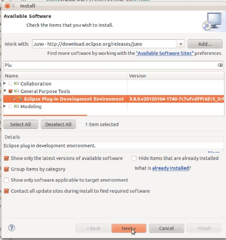

<h1>The JBoss Tools 4.x Development Environment</h1>

This article explains the different steps to set up a 1st-class environment when you want to write code for JBoss Tools.

 

<h2>Tools and technologies</h2>
<h3>Java</h3>

JBoss Tools requires Java 6. Ensure your JRE and JDK are compatible with Java 6.

 

<h3>Eclipse PDE/RCP</h3>

JBoss Tools are a set of plugins for Eclipse. Then get your favourite recent version of Eclipse from here: <a href="http://eclipse.org/downloads/" target="_blank">http://eclipse.org/downloads/</a> We recommand you using <em>Eclipse for RCP and RAP Developers</em>. But you can also install PDE in any other installation of Eclipse:

 

 

<h3>Git and EGit</h3>

Install Git CLI, and install EGit in Eclipse (EGit is already provided in most Eclipse installations).

 

<h3>m2e</h3>

m2e (maven integation for Eclipse) is also required. It's recommended that you also install <strong>m2e-tycho</strong> and <strong>m2e-EGit</strong> connector from <em>Preferences &gt; Maven &gt; Discovery &gt; Open Catalog</em>.

 

<h3>Tips for productivity and quality</h3>

Here are some highly recommanded plugins that will make your more efficient when inside the IDE

 

<h4>Install Code Recommanders</h4>

Provides additional snippets, templates and smart completion. Not intrusive. You can find it on the "Juno" update-site or the current Eclipse release site.

<h4>Static analysis</h4>

Static analysis will detect bug very early and will save you minutes of debug every day. Using it will make you and your colleagues happier. It tells you while typing code that you may have a bug. No need to wait for running test or CI reports to detect this.

<h5>Enable all JDT warnings</h5>

JDT provides very good static analysis, and can prevent you from writing bugs. You simply have to turn all "ignored" advices to "warning" in Window &gt; Preference &gt; Java &gt; Compiler &gt; Errors/Warning.

 

<h5>Install Findbugs for Eclipse</h5>

<a href="http://marketplace.eclipse.org/content/findbugs-eclipse-plugin" target="_blank">http://marketplace.eclipse.org/content/findbugs-eclipse-plugin</a>

<h5>Install PMD for Eclipse</h5>

<a href="http://marketplace.eclipse.org/content/pmd-eclipse" target="_blank">http://marketplace.eclipse.org/content/pmd-eclipse</a>

 

<h4>Coverage</h4>

Coverage answers to the question "What is tested or net?".

JBoss Tools CI builds provide Jacoco reports for coverage by unit tests (file name is jacoco.exec). This file can easily be analyzed inside Eclipse on your Java editor using EclEmma plugin: <a href="http://marketplace.eclipse.org/content/eclemma-java-code-coverage" target="_blank">http://marketplace.eclipse.org/content/eclemma-java-code-coverage</a>

 

<h2>Get source</h2>

Each JBoss Tools component is now its own GitHub repo: <a href="https://github.com/jbosstools/" target="_blank">https://github.com/jbosstools/</a> 

<h3>To work on a specific component</h3>

The easiest way to get started is to check out source for only the module you wish to work on, and import Java projects from this part of the source tree.

For example, if you want to fix a bug in the CDI component of the JavaEE project within JBoss Tools: 
  <pre>git clone git://github.com/jbosstools/jbosstools-javaee.git
  </pre>
  Then import feature, plugin and test projects from cdi/features/, cdi/plugins/, and cdi/tests/

 

<h2>Set up a target platform</h2>

 

<strong>Target Platform = Allowed Dependencies </strong>We provide several TP that have different purpose. We do set up some default TP for development, that you should use. You should use those Target Platforms instead of installing the dependencies in your IDE. Then you IDE becomes "The tools you need to develop" whereas the Target Platform provides the dependencies.

 

Import into your Eclipse workspace JBoss Tools target platforms from GitHub: 

git clone git://github.com/jbosstools/jbosstools-target-platforms.git

Then select the version you want for the target platform. Those versions are available as tags. You can see the list of tags with git tag -l.

Let's say for this example we want the latest target platform based on Eclipse 4.2.1 (Juno SR1). 

cd jbosstools-target-platforms

git checkout 4.2.1 

 

Then, in Eclipse, <em>Import &gt; Existing Maven Project</em>, browse to the <em>jbosstools-target-platfroms/jbosstools/multiple.</em>

Double-click on <em>multiple.target</em>, and click<em> Set As Target Platform</em>

<em> </em>

 

<h2>Run JBoss Tools and Tests from your IDE</h2>

Once Target Platform is configured, you can easily give a try to your plugins using<em> Run As &gt; Java Application. </em>You can also run automated tests from your IDE using <em>Run As... &gt; JUnit Plugin Tests</em>.
</body>