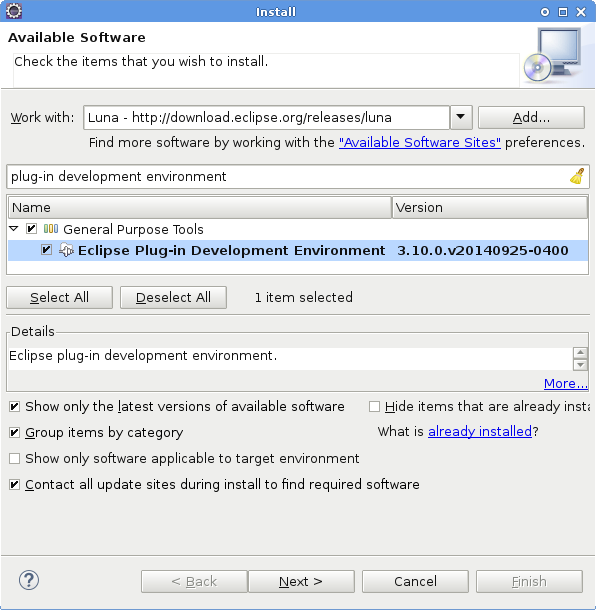
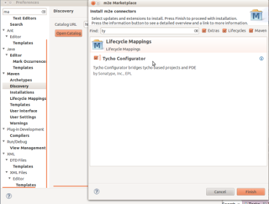
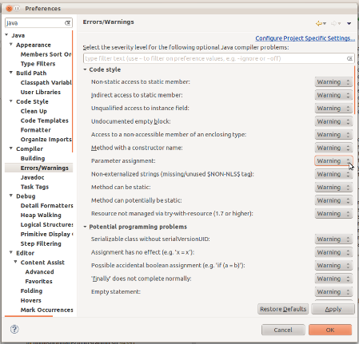
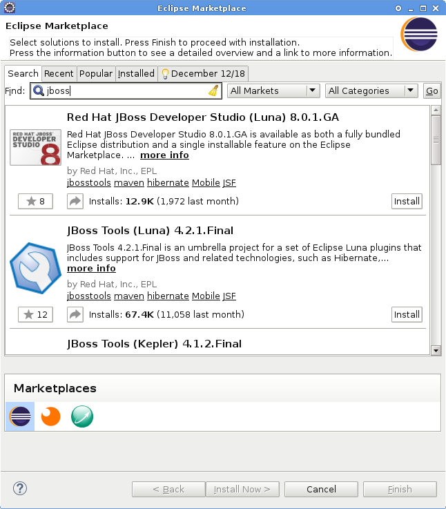

== The JBoss Tools 4.x Development Environment

This article explains the different options you have to set up a first-class development environment when looking to contribute to JBoss Tools. 

 
=== Java

JBoss Tools 4.2 requires Java 7 or 8. 

For other versions of JBoss Tools or Red Hat JBoss Developer Studio, see:

* https://developer.jboss.org/wiki/MatrixOfSupportedPlatformsRuntimesAndTechnologiesInJBossToolsJBDS[Matrix of supported platforms, runtimes and technologies in JBossTools & JBDS] or 
* https://access.redhat.com/articles/427493[Red Hat JBoss Developer Studio Components and Supported Configurations]

=== Eclipse Base Installation

When developing JBoss Tools, you have several options. We strongly suggest using either the `Eclipse RCP/RAP` or the `Eclipse JavaEE` distribution, 
as these two packages are the most complete and will require the least additional configuration. You can find either of these packages, or 
your other favorite eclipse distribution, http://eclipse.org/downloads/[here].

=== PDE - Eclipse Plug-in Development Tools

The most important part of any package you choose is that it comes with Eclipse PDE, which is Eclipse's Plugin Development Environment tools. 
To see if your chosen  distribution comes with PDE (or any other features), you can 
check http://www.eclipse.org/downloads/compare.php?release=luna[here].  If your chosen eclipse installation does not come with PDE, 
you can also install PDE into any installation of Eclipse.   Once you have your chosen distribution
downloaded and running, you can install PDE by clicking `Help -> Install New Software...` menu items. You should see a wizard similar to the one below: 

From the combo box, you'll want to select an `Update Site URL` that looks similar to `http://download.eclipse.org/releases/luna`. Search for the `Eclipse Plug-in Development Environment` feature, select it, and click 'next' to continue with the installation.

For more 
information on installing new plugins, please see http://help.eclipse.org/luna/index.jsp?topic=%2Forg.eclipse.platform.doc.user%2Ftasks%2Ftasks-124.htm[this eclipse guide]. 

=== Git and EGit

Git is the chosen version control system used by JBoss Tools. To be able to checkout (or clone) our source code, you'll first need to install git. 
The instructions for installing Git vary depending on your operating system. 
You'll probably want to check our guide on getting started with git link:configuring_git_workflow.adoc[here]. 

Once the Git command line tools are installed, you'll want to install EGit, which are tools that allow you to easily use Git from inside Eclipse. 
To see if your chosen  distribution comes with EGit, you can check http://www.eclipse.org/downloads/compare.php?release=luna[here]. 
If your chosen eclipse installation does not come with EGit, you'll want to follow the above instructions for PDE to install EGit, with some small changes. 
Specifically, you'll want to paste in the update site url found at Egit's http://eclipse.org/egit/download/[download page]. 

=== Maven

Make sure that Maven 3 (or 3.1) is available by default and Java 1.7 or later is used. 

[source,bash]
----
mvn -version

Apache Maven 3.1.1 (0728685237757ffbf44136acec0402957f723d9a; 2013-09-17 09:22:22-0600)
Maven home: /opt/maven3
Java version: 1.8.0, vendor: Oracle Corporation
Java home: /opt/jdk1.8.0/jre
Default locale: en_US, platform encoding: UTF-8
OS name: "linux", version: "3.17.4-200.fc20.x86_64", arch: "amd64", family: "unix"
----

Maven settings
~~~~~~~~~~~~~~

See https://community.jboss.org/wiki/MavenGettingStarted-Developers[Maven Getting Started - Developers] to
add a reference to the JBoss Repositories into your settings.xml. You'll also
probably need access to the SNAPSHOT repository. So here is what you
should see in your ~/.m2/settings.xml

[source,xml]
----
<settings xmlns="http://maven.apache.org/SETTINGS/1.0.0" xmlns:xsi="http://www.w3.org/2001/XMLSchema-instance" xsi:schemaLocation="http://maven.apache.org/SETTINGS/1.0.0 http://maven.apache.org/xsd/settings-1.0.0.xsd">
  <profiles>
    <profile>
    <id>jboss-default</id>
    <repositories>
    <!-- To resolve parent artifact -->
    <repository>
        <id>jboss-public-repository-group</id>
        <name>JBoss Public Repository Group</name>
        <url>http://repository.jboss.org/nexus/content/groups/public/</url>
      </repository>
      <repository>
        <id>jboss-snapshots-repository</id>
        <name>JBoss Snapshots Repository</name>
        <url>https://repository.jboss.org/nexus/content/repositories/snapshots/</url>   
      </repository>
    </repositories>
    <pluginRepositories>
      <!-- To resolve parent artifact -->
      <pluginRepository>
        <id>jboss-public-repository-group</id>
        <name>JBoss Public Repository Group</name>
        <url>http://repository.jboss.org/nexus/content/groups/public/</url>   
      </pluginRepository>
      <pluginRepository>
        <id>jboss-snapshots-repository</id>
        <name>JBoss Snapshots Repository</name>
        <url>https://repository.jboss.org/nexus/content/repositories/snapshots/</url>   
      </pluginRepository>
    </pluginRepositories>
    </profile>
  </profiles>
  <activeProfiles>
    <activeProfile>jboss-default</activeProfile>
  ...
  </activeProfiles>
</settings>
----

Maven & Java Memory Configuration
~~~~~~~~~~~~~~~~~~~~~~~~~~~~~~~~~

To configure the amount of memory used by Maven, you can define MVN_OPTS
as follows, either in the mvn / mvn.bat script you use to run Maven, or
set as global environment variables. Here's how to do so for
http://forums.fedoraforum.org/showthread.php?t=262465[Fedora],
https://help.ubuntu.com/community/EnvironmentVariables[Ubuntu],
http://forums.techarena.in/windows-xp-support/1152405.htm[Windows],
http://www.digitaledgesw.com/node/31[OSX].

[source,bash]
----
set MAVEN_OPTS=-Xms512m -Xmx1024m -XX:PermSize=128m -XX:MaxPermSize=256m
----

==== m2e

m2e (maven integation for Eclipse) is also required to get the most out of your development experience with JBoss Tools. JBoss Tools uses Maven, and a maven plugin 
Tycho, to build our tools. To see if your chosen  distribution comes with m2e, you can check http://www.eclipse.org/downloads/compare.php?release=luna[here]. 
If your chosen Eclipse installation does not come with m2e, you'll want to follow the above instructions to install m2e, using the update site
url found at m2e's http://download.eclipse.org/technology/m2e/releases/[download page]. 

Once m2e is installed, we recommend that you also install *m2e-tycho* and *m2e-EGit* connector from `Window -> Preferences -> Maven -> Discovery -> Open Catalog`.

== Tips for productivity and quality

Here are some highly recommended plugins that will make you more efficient when working inside the IDE

=== Code Recommenders

Code Recommenders provides additional snippets, templates and smart auto-completion. It is not intrusive. You can find it on the latest Eclipse release update site, using an update site url such as `http://download.eclipse.org/releases/luna/`

=== Static analysis

Static analysis will detect bugs very early in your development, could save you hours of debugging, and improve team morale. Static Analysis tools will warn you of bugs that it can detect while you are still typing the code. You won't need to wait for tests to run or CI reports to be published in order to detect this.

==== Enable all JDT warnings

JDT provides very good static analysis, and can prevent you from writing bugs. You simply have to turn all "ignored" advices to "warning" 
in `Window -> Preference -> Java -> Compiler -> Errors/Warning`

==== Install Findbugs &amp; PMD for Eclipse

Findbugs and PMD are both tools used for static code analysis. Both are useful additions to your development environment, 
and will ensure that your patches and contributions are more likely to remain free of the most common bugs. 

You can install both http://marketplace.eclipse.org/content/findbugs-eclipse-plugin[FindBugs] and http://marketplace.eclipse.org/content/pmd-eclipse[PMD] in the Eclipse Marketplace. The Eclipse Marketplace can be accessed in Eclipse via `Help -> Eclipse Marketplace...`. 

You can then search the Marketplace and select PMD and Findbugs to install:

image::../images/install-pmd-findbugs-from-eclipse-marketplace.png[]

If your Eclipse does not include the Marketplace, you should first install it from the http://download.eclipse.org/mpc/luna/[Marketplace Client update site]. 

==== Coverage

Coverage answers the question "What has been tested?"

JBoss Tools CI builds provide Jacoco reports for coverage by unit tests (file name is jacoco.exec). This file can easily be analyzed inside Eclipse on your Java editor using the EclEmma plugin. 
The http://marketplace.eclipse.org/content/eclemma-java-code-coverage[EclEmma plugin] can also be installed from Eclipse Marketplace, as in the previous section above. 

== Conclusion

Now that you're all done here, you'll want to learn all about target platforms. Please go back to link:../README.adoc#setting-up-the-target-platform[the index] to move forward with setting up your target platform. 
