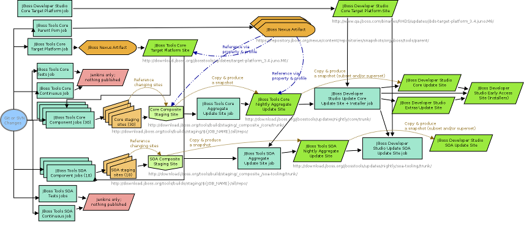

<!DOCTYPE html PUBLIC "-//W3C//DTD HTML 4.01 Transitional//EN" "http://www.w3.org/TR/html4/loose.dtd">
<html>
<head>
<meta http-equiv="Content-Type" content="text/html; charset=UTF-8">
<title>Build Job Cascade + Results</title>

</head>
<!--
  s#_Trunk#_7.0.kepler#g
  s#/(jbosstools.*)_master#/\1_41#g
  s#/(devstudio.*)_master#/\1_70#g
-->
<body>
<body marginheight="0" marginwidth="0" leftmargin="0" topmargin="0">
<table marginheight="0" marginwidth="0" leftmargin="0" topmargin="0"
  cellspacing="0" cellpadding="0">
  <tr>
    <td colspan="2"></td>
  </tr>
  <tr>
    <td class="bodyText">&#160;&#160;</td>
  </tr>
  <tr>
    <td class="bodyText">&#160;&#160;</td>
    <td class="bodyText"><h2 class="title">JBoss Tools 4.2.x <b style="color:black">/</b> <b style="color:red">JBoss Developer Studio 7.1.x</b> (Kepler? Luna?) <b style="color:black">[master]</b></h2>

  
<a href="javascript:toggle()"> <small>Click to enlarge</small></a>
    
    </td>
  </tr>
  <tr>
    <td class="bodyText">&#160;&#160;</td>
    <td class="bodyText">

    
<i>Note: <b style="color: red">red
    links</b> require VPN access.</i>
    
    <h2 class="title">Build Job Cascade:</h2>
    <ul>
      <li><a style="color: red"
        href="https://jenkins.mw.lab.eng.bos.redhat.com/hudson/job/jbosstoolstargetplatforms-matrix">Local
      JBT &amp; JBDS Target Platforms</a> (update sites)</li>
      <ul>
        <li><a style="color: red"
          href="https://jenkins.mw.lab.eng.bos.redhat.com/hudson/job/jbosstools-buildflow_master">Build Flow</a> (once a week, all the projects' jobs are 
          built in order) 
          - <a href=swimlanes.md>Interdependencies between jobs &amp; job order, aka "swimlanes"</a></li>
        <li><a style="color: red"
          href="https://jenkins.mw.lab.eng.bos.redhat.com/hudson/view/DevStudio/view/DevStudio_Trunk/">All projects' jobs, overall test results, unstable jobs</a></li>
        <ul>
          <li><a style="color: red"
            href="https://jenkins.mw.lab.eng.bos.redhat.com/hudson/job/jbosstools-build-sites.aggregate.webtools-site_master">JBT - Web Tools 
          build</a> (collect components into a single update site for use as WTP Server Adapter)
          </li>
          <ul>
            <li><a style="color: red"
            href="https://jenkins.mw.lab.eng.bos.redhat.com/hudson/job/jbosstools-build-sites.aggregate.site_master">JBT - Core
          build</a> (collect components into a single update site for downstream use and publishing to sf.net)
            </li>
          

            <ul>
              <li><a style="color: red"
                href="https://jenkins.mw.lab.eng.bos.redhat.com/hudson/job/devstudio.product_master">JBDS
              Product build</a> (update site + installer)
              </li>
            </ul>
          </ul>
        </ul>
      </ul>
    </ul>
    <ul>
    

      <li><a style="color: red"
        href="https://jenkins.mw.lab.eng.bos.redhat.com/hudson/job/jbosstools-discovery_master">JBT/JBDS Central
      Discovery build</a> (directory.xml &amp; plugin.jar + composite update site)
      </li>
    </ul>

    <h2 class="title">Results:</h2>
    <ul>
      <li><a
        href="http://download.jboss.org/jbosstools/targetplatforms/jbosstoolstarget/">JBT Target Platforms</a> &amp; <a style="color: red"
        href="http://www.qa.jboss.com/binaries/RHDS/targetplatforms/jbdevstudiotarget/">JBDS Target Platforms</a>
      <ul>
        <li><a
          href="http://download.jboss.org/jbosstools/builds/staging/">JBT Project builds</a> (staging)
        :: <a
          href="http://download.jboss.org/jbosstools/builds/staging/_composite_/core/trunk/">composite update site</a></li>
        <ul>
          <li><a href="http://download.jboss.org/jbosstools/builds/nightly/webtools/">JBT - Web Tools</a> (nightly)
          :: <a href="http://download.jboss.org/jbosstools/builds/nightly/webtools/trunk/latestBuild.html">latest builds</a>
          :: <b><a href="http://download.jboss.org/jbosstools/updates/nightly/webtools/trunk/">latest updates</a></b>
          <ul>
            <li><a href="http://download.jboss.org/jbosstools/builds/nightly/core/">JBT - Core Tools</a> (nightly)
          :: <a href="http://download.jboss.org/jbosstools/builds/nightly/core/trunk/latestBuild.html">latest builds</a> 
          :: <b><a href="http://download.jboss.org/jbosstools/updates/nightly/core/trunk/">latest updates</a></b>
            

            <ul>
              <li><b><a style="color: red"
                href="http://www.qa.jboss.com/binaries/RHDS/builds/staging/devstudio.product_master/installer/">JBDS Installer</a></b> :: 
                <b><a style="color: red"
                href="http://www.qa.jboss.com/binaries/RHDS/builds/staging/devstudio.product_master/all/repo/">Update Site</a></b>
              </li>
            </ul>
          </ul>
        </ul>
      </ul>
    </ul>
    <ul>
      

      <li>
        <a href="http://download.jboss.org/jbosstools/discovery/nightly/core/trunk/jbosstools-directory.xml">JBT directory.xml</a> ::
        <a href="http://download.jboss.org/jbosstools/discovery/nightly/core/trunk/">JBT Discovery Site</a>
      </li>
      <li>
        <a style="color: red" href="http://www.qa.jboss.com/binaries/RHDS/discovery/nightly/core/trunk/devstudio-directory.xml">JBDS directory.xml</a> ::
        <a style="color: red" href="http://www.qa.jboss.com/binaries/RHDS/discovery/nightly/core/trunk/">JBDS Discovery Site</a>
      </li>
    </ul>
    </td>
  </tr>
</table>

<i><small>Last updated 2013-04-07</small></i>
 <small><a href=trunk.md>trunk</a> :: <a href=4.1.kepler.md>4.1.x / 7.x (Kepler)</a> :: <a href=4.0.juno.md>4.0.x / 6.x (Juno)</a> :: <a href=3.3.indigo.md>3.3.x / 5.x (Indigo)</a> :: <a href=3.2.helios.md>3.2.x / 4.x (Helios)</a></small>

</body>
</html>
