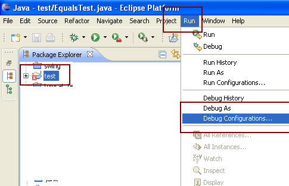
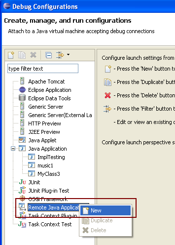
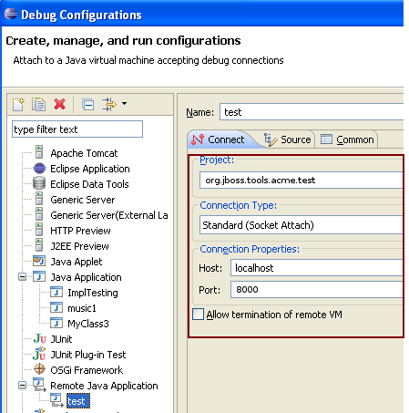

# Debugging Surefire Tests

## Useful debug files in Jenkins workspace

Maven _target/_ folder actually contains all the files related to your build and tests. Assuming a test is failing in the *org.jboss.tools.acme.test* suite, here are a set of interesting locations to help debugging:

* _tests/org.jboss.tools.acme.test/target/work/configuration/config.ini_ contains the main configuration of the plugin. The most interesting part is the `osgi.bundles` property which lists all bundles that are installed in the application which runs test. It's the right place to check for a missing dependency
* _tests/org.jboss.tools.acme.test/target/work/data_ is the test workspace, where you can access create projects, and
* _tests/org.jboss.tools.acme.test/target/work/data/.metadata/.log_ contains the log of the test execution
* _tests/org.jboss.tools.acme.test/target/work/data/.metadata_ contains all other Eclipse runtime metadata (such as workbench state, preferences...)

## Useful input in maven build log

Maven's build log shows a very interesting commandline while running surefire tests. It looks like:
```
[INFO] --- tycho-surefire-plugin:0.18.0:test (default-test) @ org.jboss.tools.runtime.seam.detector.test ---
[INFO] Expected eclipse log file: /mnt/hudson_workspace/workspace/jbosstools-javaee_41/sources/seam/tests/org.jboss.tools.runtime.seam.detector.test/target/work/data/.metadata/.log
[INFO] Command line:
 	/bin/sh -c cd /mnt/hudson_workspace/workspace/jbosstools-javaee_41/sources/seam/tests/org.jboss.tools.runtime.seam.detector.test && /qa/tools/opt/x86_64/jdk1.6.0_43/jre/bin/java -Dosgi.noShutdown=false -Dosgi.os=linux -Dosgi.ws=gtk -Dosgi.arch=x86_64 '-javaagent:/mnt/hudson_workspace/workspace/jbosstools-javaee_41/.repository/org/jacoco/org.jacoco.agent/0.6.1.201212231917/org.jacoco.agent-0.6.1.201212231917-runtime.jar=destfile=/mnt/hudson_workspace/workspace/jbosstools-javaee_41/sources/seam/target/jacoco.exec,append=true,includes=org.jboss.tools.*' -Xms512m -Xmx1024m -XX:PermSize=256m -XX:MaxPermSize=256m -Djbosstools.test.jboss.home.4.2=/mnt/hudson_workspace/workspace/jbosstools-javaee_41/sources/seam/tests/org.jboss.tools.runtime.seam.detector.test/target/requirements/jboss-4.2.3.GA -Dorg.jboss.tools.tests.skipPrivateRequirements=false -Dusage_reporting_enabled=false -Dorg.jboss.tools.tests.skipPrivateRequirements=false -Dorg.eclipse.ui.testsDisableWorkbenchAutoSave=true -jar /mnt/hudson_workspace/workspace/jbosstools-javaee_41/.repository/p2/osgi/bundle/org.eclipse.equinox.launcher/1.3.0.v20130327-1440/org.eclipse.equinox.launcher-1.3.0.v20130327-1440.jar -data /mnt/hudson_workspace/workspace/jbosstools-javaee_41/sources/seam/tests/org.jboss.tools.runtime.seam.detector.test/target/work/data -install /mnt/hudson_workspace/workspace/jbosstools-javaee_41/sources/seam/tests/org.jboss.tools.runtime.seam.detector.test/target/work -configuration /mnt/hudson_workspace/workspace/jbosstools-javaee_41/sources/seam/tests/org.jboss.tools.runtime.seam.detector.test/target/work/configuration -application org.eclipse.tycho.surefire.osgibooter.uitest -testproperties /mnt/hudson_workspace/workspace/jbosstools-javaee_41/sources/seam/tests/org.jboss.tools.runtime.seam.detector.test/target/surefire.properties -testApplication org.eclipse.ui.ide.workbench -product org.jboss.tools.tests.product
```
This commandline is the actual command used to run your tests. You can copy and paste this commandline if you want to run those tests outside of Maven. 

Reading the parameters in the commandline could also explain differences between expected and actual behavior of tests.

## Using the Eclipse debugger

Instead of running a `mvn clean verify` to simply see your Surefire/JUnit tests run in a console, you can also debug them interactively using http://www.eclipse.org/tycho/sitedocs/tycho-surefire/tycho-surefire-plugin/test-mojo.html#debugPort[-DdebugPort=8000], or any port number you'd like:

```
mvn clean verify -DdebugPort=8000
```

Then, from Eclipse, create a Launch Configuration using "Debug Remote Java Application". 

To begin, click on `Run -> Debug Configurations...`



Right click `Remote Java Application` and select `New`



Set the port to `8000`, or whatever port you used above, and select the workspace project you want to debug.

The only necessary inputs are the project you want to test, and the port on which the debugger will listen (8000 for this example).



Click `Apply` then `Close`.

Set a breakpoint in your code, then from the `Run` menu, you can launch the debugger to trace through the code to find the source of the problem. 

When the maven build completes, the debugPort will be dropped. If you start the build again, you can then reconnect the debugger as needed.


