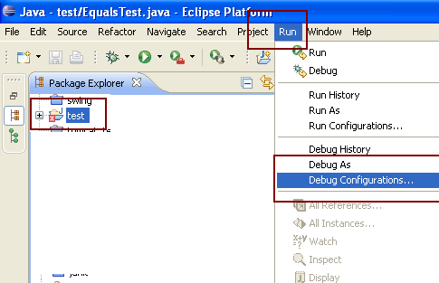

= How to test a JBoss Tools component build

If you haven't yet gotten your local build installed, please see link:how_to_install_a_build.adoc[How to Install a Local Build].

== Everything's Installed, Now what? 

Once you have either downloaded a full build of JBoss Tools, installed from an update site, or otherwise installed the pieces you want to test, you can run your eclipse and begin testing. When running in this fashion, there's no easy debugging capability, and so you are basically limited to usability testing and replicating bugs. 

There are, however, three options you have to get more information:

* Checking Logs
* Tracing
* Debugging via a second eclipse instance

=== Logging

See link:tracing_logging_in_eclipse.adoc#How-to-gather-eclipse-logs-and-system-configuration-details[How to gather Eclipse logs and system configuration details]

=== Tracing

See link:tracing_logging_in_eclipse.adoc#How-to-enable-tracing-in-eclipse[How to enable tracing in Eclipse]


== Debugging via a second eclipse instance

After installing and running your locally built units and all dependencies, you can start up that eclipse instance to 
test the primary features. If you encounter a bug and cannot discover the cause, you may opt to run this instance in debug
mode, and use a second eclipse instance (with your source code in the workspace) to connect to the first. 

=== Modifying eclipse.ini of target

You'll first need to modify the `eclipse.ini` of your target eclipse. The target eclipse is the instance
you have installed the various plugins you are testing. You can do this by adding the following after `-vmargs`:

```
-Xdebug
-Xrunjdwp:transport=dt_socket,server=y,suspend=y,address=1044
```

=== Run Your Target Eclipse

When running your target eclipse installation, you should now see the following:

```
[rob@rawbdor e2]$ ./eclipse 
Listening for transport dt_socket at address: 1044
```

Eclipse is now waiting for a second instance to connect to it. 

=== Connecting from Developer Workspace

At this point, you will need to connect to the running eclipse instance via `Remote Debugging` from your
development environment, which is the eclipse installation you were using to write your code changes. 
This workspace should have all of the projects you wish to trace through already in the workspace. 

To begin, click on `Run -> Debug Configurations...`



Right click on `Remote Java Application` and select `New`

image::../images/remote_Debugging_2.PNG[Remote Debugging 1]

Set the port to `1044`


You are then free to launch this remote debugging configuration immediately, set breakpoints in your various source files, 
and trace through the code to find the source of the problem. 


