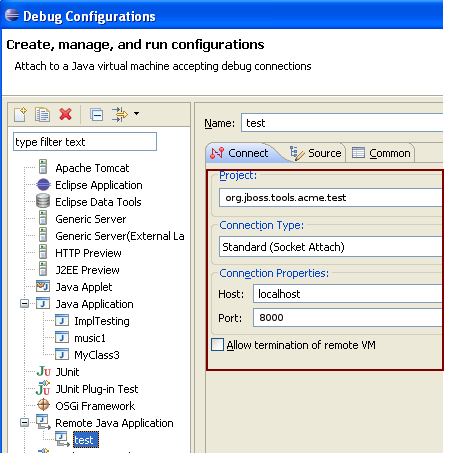

= Using the Eclipse remote debugger

Instead of running a `mvn clean verify` to simply see your tests run in a console, you can also debug them interactively using http://www.eclipse.org/tycho/sitedocs/tycho-surefire/tycho-surefire-plugin/test-mojo.html#debugPort[-DdebugPort=8000]. 

To attach an Eclipse instance to a running Maven build, do this:

```
mvn verify -DdebugPort=8000
```

Then launch Eclipse, browse to the project in your workspace, and create a new Remote Java Application from the Debug Configurations menu. This will allow you to set breakpoints in your Eclipse workspace project and step through them as the maven build runs on the debug port.

Create a Launch Configuration using "Debug Remote Java Application". 

To begin, click on `Run -> Debug Configurations...`

image::../images/remote_Debugging_1.PNG[Remote Debugging 1]

Right click `Remote Java Application` and select `New`

image::../images/remote_Debugging_2.PNG[Remote Debugging 2]

Set the port to `8000`, or whatever port you used above, and select the workspace project you want to debug.

The only necessary inputs are the project you want to test, and the port on which the debugger will listen (8000 for this example).



Click `Apply` then `Close`.

Set a breakpoint in your code, then from the `Run` menu, you can launch the debugger to trace through the code to find the source of the problem. 

When the maven build completes, the debugPort will be dropped. If you start the build again, you can then reconnect the debugger as needed.

See also: link:debug_tycho_tests.adoc[Debugging Maven (Surefire) Unit Tests]