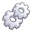

== Projects in JBoss Tools 

Below is a table listing the projects in http://tools.jboss.org/downloads/overview.html[JBoss Tools], with links to their source repos, builds, update sites, & jobs. 

You can also see which projects are mature enough to be included in http://www.jboss.org/products/devstudio/download/[Red Hat JBoss Developer Studio] (JBDS), JBoss Central, or available from Early Access within Central.

IMPORTANT: _[blue]#Looking for 4.3.x? See https://github.com/jbosstools/jbosstools-devdoc/blob/jbosstools-4.3.x/list_of_projects.adoc[4.3.x Branch Project List]#_

WARNING: _[red]#Some links may not work yet, if jobs have not yet been created. Please https://issues.jboss.org/secure/CreateIssue.jspa?pid=10020&issuetype=1[open a JIRA] or http://jenkins.mw.lab.eng.bos.redhat.com/hudson/view/DevStudio/view/DevStudio_Master/[search for the job] you need.#_

.JBoss Tools - 4.4 branch
[cols="<3e,^1m,^1m,^1m,^1m",options="header"]
|===
|Name |Repo|Job|Build / Log|Update Site

|JBoss Tools Core (aggregate site)
|
|image:images/confighistory.png[title="job", alt="job", link="http://jenkins.mw.lab.eng.bos.redhat.com/hudson/job/jbosstools-build-sites.aggregate.site_master/"]
|image:images/search.png[title="build", alt="build", link="http://download.jboss.org/jbosstools/neon/snapshots/builds/jbosstools-build-sites.aggregate.site_master/"]
image:images/terminal.png[title="log", alt="log", link="http://download.jboss.org/jbosstools/neon/snapshots/builds/jbosstools-build-sites.aggregate.site_master/latest/logs/BUILDLOG.txt"]
|

|JBoss Tools Tests (aggregate site)
|
|image:images/confighistory.png[title="job", alt="job", link="http://jenkins.mw.lab.eng.bos.redhat.com/hudson/job/jbosstools-build-sites.aggregate.coretests-site_master/"]
|image:images/search.png[title="build", alt="build", link="http://download.jboss.org/jbosstools/neon/snapshots/builds/jbosstools-build-sites.aggregate.coretests-site_master/"]
image:images/terminal.png[title="log", alt="log", link="http://download.jboss.org/jbosstools/neon/snapshots/builds/jbosstools-build-sites.aggregate.coretests-site_master/latest/logs/BUILDLOG.txt"]
|

|JBoss Tools Target Platform (3rd party)
|
|image:images/confighistory.png[title="job", alt="job", link="http://jenkins.mw.lab.eng.bos.redhat.com/hudson/job/jbosstoolstargetplatforms-matrix/"]
|image:images/search.png[title="build", alt="build", link="http://download.jboss.org/jbosstools/targetplatforms/jbosstoolstarget/"]
image:images/terminal.png[title="log", alt="log", link="http://jenkins.mw.lab.eng.bos.redhat.com/hudson/job/jbosstoolstargetplatforms-matrix/lastBuild/console"]
|image:images/search.png[title="build", alt="build", link="http://download.jboss.org/jbosstools/targetplatforms/jbosstoolstarget/"]

|===

.JBoss Tools Projects - 4.4 branch
[cols="e,^m,^m,^m,^m,<",options="header"]
|===
|Name |Repo|Job|Build / Log|Update Site|Available From 

|aerogear
|
|image:images/confighistory.png[title="job", alt="job", link="http://jenkins.mw.lab.eng.bos.redhat.com/hudson/job/jbosstools-aerogear_master/"]
|image:images/search.png[title="build", alt="build", link="http://download.jboss.org/jbosstools/neon/snapshots/builds/jbosstools-aerogear_master/"]
image:images/terminal.png[title="log", alt="log", link="http://download.jboss.org/jbosstools/neon/snapshots/builds/jbosstools-aerogear_master/latest/logs/BUILDLOG.txt"]
|
|Tools, JBDS

|arquillian
|
|image:images/confighistory.png[title="job", alt="job", link="http://jenkins.mw.lab.eng.bos.redhat.com/hudson/job/jbosstools-arquillian_master/"]
|image:images/search.png[title="build", alt="build", link="http://download.jboss.org/jbosstools/neon/snapshots/builds/jbosstools-arquillian_master/"]
image:images/terminal.png[title="log", alt="log", link="http://download.jboss.org/jbosstools/neon/snapshots/builds/jbosstools-arquillian_master/latest/logs/BUILDLOG.txt"]
|
|Tools, JBDS Early Access

|base
|
|image:images/confighistory.png[title="job", alt="job", link="http://jenkins.mw.lab.eng.bos.redhat.com/hudson/job/jbosstools-base_master/"]
|image:images/search.png[title="build", alt="build", link="http://download.jboss.org/jbosstools/neon/snapshots/builds/jbosstools-base_master/"]
image:images/terminal.png[title="log", alt="log", link="http://download.jboss.org/jbosstools/neon/snapshots/builds/jbosstools-base_master/latest/logs/BUILDLOG.txt"]
|
|Tools, JBDS

|birt
|
|image:images/confighistory.png[title="job", alt="job", link="http://jenkins.mw.lab.eng.bos.redhat.com/hudson/job/jbosstools-birt_master/"]
|image:images/search.png[title="build", alt="build", link="http://download.jboss.org/jbosstools/neon/snapshots/builds/jbosstools-birt_master/"]
image:images/terminal.png[title="log", alt="log", link="http://download.jboss.org/jbosstools/neon/snapshots/builds/jbosstools-birt_master/latest/logs/BUILDLOG.txt"]
|
|Tools

|browsersim
|
|image:images/confighistory.png[title="job", alt="job", link="http://jenkins.mw.lab.eng.bos.redhat.com/hudson/job/jbosstools-browsersim_master/"]
|image:images/search.png[title="build", alt="build", link="http://download.jboss.org/jbosstools/neon/snapshots/builds/jbosstools-browsersim_master/"]
image:images/terminal.png[title="log", alt="log", link="http://download.jboss.org/jbosstools/neon/snapshots/builds/jbosstools-browsersim_master/latest/logs/BUILDLOG.txt"]
|
|Tools, JBDS

|central
|
|image:images/confighistory.png[title="job", alt="job", link="http://jenkins.mw.lab.eng.bos.redhat.com/hudson/job/jbosstools-central_master/"]
|image:images/search.png[title="build", alt="build", link="http://download.jboss.org/jbosstools/neon/snapshots/builds/jbosstools-central_master/"]
image:images/terminal.png[title="log", alt="log", link="http://download.jboss.org/jbosstools/neon/snapshots/builds/jbosstools-central_master/latest/logs/BUILDLOG.txt"]
|
|Tools, JBDS

|forge
|
|image:images/confighistory.png[title="job", alt="job", link="http://jenkins.mw.lab.eng.bos.redhat.com/hudson/job/jbosstools-forge_master/"]
|image:images/search.png[title="build", alt="build", link="http://download.jboss.org/jbosstools/neon/snapshots/builds/jbosstools-forge_master/"]
image:images/terminal.png[title="log", alt="log", link="http://download.jboss.org/jbosstools/neon/snapshots/builds/jbosstools-forge_master/latest/logs/BUILDLOG.txt"]
|
|Tools, JBDS

|freemarker
|
|image:images/confighistory.png[title="job", alt="job", link="http://jenkins.mw.lab.eng.bos.redhat.com/hudson/job/jbosstools-freemarker_master/"]
|image:images/search.png[title="build", alt="build", link="http://download.jboss.org/jbosstools/neon/snapshots/builds/jbosstools-freemarker_master/"]
image:images/terminal.png[title="log", alt="log", link="http://download.jboss.org/jbosstools/neon/snapshots/builds/jbosstools-freemarker_master/latest/logs/BUILDLOG.txt"]
|
|Tools, JBDS

|hibernate
|
|image:images/confighistory.png[title="job", alt="job", link="http://jenkins.mw.lab.eng.bos.redhat.com/hudson/job/jbosstools-hibernate_master/"]
|image:images/search.png[title="build", alt="build", link="http://download.jboss.org/jbosstools/neon/snapshots/builds/jbosstools-hibernate_master/"]
image:images/terminal.png[title="log", alt="log", link="http://download.jboss.org/jbosstools/neon/snapshots/builds/jbosstools-hibernate_master/latest/logs/BUILDLOG.txt"]
|
|Tools, JBDS

|javaee
|
|image:images/confighistory.png[title="job", alt="job", link="http://jenkins.mw.lab.eng.bos.redhat.com/hudson/job/jbosstools-javaee_master/"]
|image:images/search.png[title="build", alt="build", link="http://download.jboss.org/jbosstools/neon/snapshots/builds/jbosstools-javaee_master/"]
image:images/terminal.png[title="log", alt="log", link="http://download.jboss.org/jbosstools/neon/snapshots/builds/jbosstools-javaee_master/latest/logs/BUILDLOG.txt"]
|
|Tools, JBDS

|jst
|
|image:images/confighistory.png[title="job", alt="job", link="http://jenkins.mw.lab.eng.bos.redhat.com/hudson/job/jbosstools-jst_master/"]
|image:images/search.png[title="build", alt="build", link="http://download.jboss.org/jbosstools/neon/snapshots/builds/jbosstools-jst_master/"]
image:images/terminal.png[title="log", alt="log", link="http://download.jboss.org/jbosstools/neon/snapshots/builds/jbosstools-jst_master/latest/logs/BUILDLOG.txt"]
|
|Tools, JBDS

|livereload
|
|image:images/confighistory.png[title="job", alt="job", link="http://jenkins.mw.lab.eng.bos.redhat.com/hudson/job/jbosstools-livereload_master/"]
|image:images/search.png[title="build", alt="build", link="http://download.jboss.org/jbosstools/neon/snapshots/builds/jbosstools-livereload_master/"]
image:images/terminal.png[title="log", alt="log", link="http://download.jboss.org/jbosstools/neon/snapshots/builds/jbosstools-livereload_master/latest/logs/BUILDLOG.txt"]
|
|Tools, JBDS

|locus
|
|image:images/confighistory.png[title="job", alt="job", link="http://jenkins.mw.lab.eng.bos.redhat.com/hudson/job/jbosstools-locus.site_master"]
|image:images/search.png[title="build", alt="build", link="http://repository.jboss.org/nexus/content/unzip/unzip/org/jboss/tools/locus/update.site/"]
image:images/terminal.png[title="log", alt="log", link="http://jenkins.mw.lab.eng.bos.redhat.com/hudson/job/jbosstools-locus.site_master/lastBuild/console"]
|

|Tools, JBDS

|openshift
|
|image:images/confighistory.png[title="job", alt="job", link="http://jenkins.mw.lab.eng.bos.redhat.com/hudson/job/jbosstools-openshift_master/"]
|image:images/search.png[title="build", alt="build", link="http://download.jboss.org/jbosstools/neon/snapshots/builds/jbosstools-openshift_master/"]
image:images/terminal.png[title="log", alt="log", link="http://download.jboss.org/jbosstools/neon/snapshots/builds/jbosstools-openshift_master/latest/logs/BUILDLOG.txt"]
|
|Tools, JBDS

|playground
|
|image:images/confighistory.png[title="job", alt="job", link="http://jenkins.mw.lab.eng.bos.redhat.com/hudson/job/jbosstools-playground_master/"]
|image:images/search.png[title="build", alt="build", link="http://download.jboss.org/jbosstools/neon/snapshots/builds/jbosstools-playground_master/"]
image:images/terminal.png[title="log", alt="log", link="http://download.jboss.org/jbosstools/neon/snapshots/builds/jbosstools-playground_master/latest/logs/BUILDLOG.txt"]
|
|Tools, JBDS

|portlet
|
|image:images/confighistory.png[title="job", alt="job", link="http://jenkins.mw.lab.eng.bos.redhat.com/hudson/job/jbosstools-portlet_master/"]
|image:images/search.png[title="build", alt="build", link="http://download.jboss.org/jbosstools/neon/snapshots/builds/jbosstools-portlet_master/"]
image:images/terminal.png[title="log", alt="log", link="http://download.jboss.org/jbosstools/neon/snapshots/builds/jbosstools-portlet_master/latest/logs/BUILDLOG.txt"]
|
|Tools, JBDS

|server
|
|image:images/confighistory.png[title="job", alt="job", link="http://jenkins.mw.lab.eng.bos.redhat.com/hudson/job/jbosstools-server_master/"]
|image:images/search.png[title="build", alt="build", link="http://download.jboss.org/jbosstools/neon/snapshots/builds/jbosstools-server_master/"]
image:images/terminal.png[title="log", alt="log", link="http://download.jboss.org/jbosstools/neon/snapshots/builds/jbosstools-server_master/latest/logs/BUILDLOG.txt"]
|
|Tools, JBDS

|vpe
|
|image:images/confighistory.png[title="job", alt="job", link="http://jenkins.mw.lab.eng.bos.redhat.com/hudson/job/jbosstools-vpe_master/"]
|image:images/search.png[title="build", alt="build", link="http://download.jboss.org/jbosstools/neon/snapshots/builds/jbosstools-vpe_master/"]
image:images/terminal.png[title="log", alt="log", link="http://download.jboss.org/jbosstools/neon/snapshots/builds/jbosstools-vpe_master/latest/logs/BUILDLOG.txt"]
|
|Tools, JBDS

|webservices
|
|image:images/confighistory.png[title="job", alt="job", link="http://jenkins.mw.lab.eng.bos.redhat.com/hudson/job/jbosstools-webservices_master/"]
|image:images/search.png[title="build", alt="build", link="http://download.jboss.org/jbosstools/neon/snapshots/builds/jbosstools-webservices_master/"]
image:images/terminal.png[title="log", alt="log", link="http://download.jboss.org/jbosstools/neon/snapshots/builds/jbosstools-webservices_master/latest/logs/BUILDLOG.txt"]
|
|Tools, JBDS

|===

.JBoss Tools Central - 4.4.x branch
[cols="3e,^1m,^1m,1m,^1m,^1m",options="header"]
|===
|Name |Repo|Job|Build / Log|Update Site|Discovery Site

|JBoss Tools Central Discovery 
|
|image:images/confighistory.png[title="job", alt="job", link="http://jenkins.mw.lab.eng.bos.redhat.com/hudson/job/jbosstools-discovery_master/"]
|image:images/search.png[title="build", alt="build", link="http://download.jboss.org/jbosstools/neon/snapshots/builds/jbosstools-discovery.central_master/"]
image:images/terminal.png[title="log", alt="log", link="http://download.jboss.org/jbosstools/neon/snapshots/builds/jbosstools-discovery.central_master/latest/logs/BUILDLOG.txt"]
|
|

|JBoss Tools Central Discovery -  Early Access
|
|image:images/confighistory.png[title="job", alt="job", link="http://jenkins.mw.lab.eng.bos.redhat.com/hudson/job/jbosstools-discovery_master/"]
|image:images/search.png[title="build", alt="build", link="http://download.jboss.org/jbosstools/neon/snapshots/builds/jbosstools-discovery.earlyaccess_master/"]
image:images/terminal.png[title="log", alt="log", link="http://download.jboss.org/jbosstools/neon/snapshots/builds/jbosstools-discovery.earlyaccess_master/latest/logs/BUILDLOG.txt"]
|
|

|JBoss Tools Central (aggregate site)
|
|image:images/confighistory.png[title="job", alt="job", link="http://jenkins.mw.lab.eng.bos.redhat.com/hudson/job/jbosstools-build-sites.aggregate.child-sites_master/"]
|image:images/search.png[title="build", alt="build", link="http://download.jboss.org/jbosstools/neon/snapshots/builds/jbosstools-build-sites.aggregate.central-site_master/"]
image:images/terminal.png[title="log", alt="log", link="http://download.jboss.org/jbosstools/neon/snapshots/builds/jbosstools-build-sites.aggregate.central-site_master/latest/logs/BUILDLOG.txt"]
|
|n/a

|JBoss Tools Central - Early Access (aggregate site)
|
|image:images/confighistory.png[title="job", alt="job", link="http://jenkins.mw.lab.eng.bos.redhat.com/hudson/job/jbosstools-build-sites.aggregate.child-sites_master/"]
|image:images/search.png[title="build", alt="build", link="http://download.jboss.org/jbosstools/neon/snapshots/builds/jbosstools-build-sites.aggregate.earlyaccess-site_master/"]
image:images/terminal.png[title="log", alt="log", link="http://download.jboss.org/jbosstools/neon/snapshots/builds/jbosstools-build-sites.aggregate.earlyaccess-site_master/latest/logs/BUILDLOG.txt"]
|
|n/a

|Central Target Platform (3rd party)
|
|image:images/confighistory.png[title="job", alt="job", link="http://jenkins.mw.lab.eng.bos.redhat.com/hudson/job/jbosstools-centraltarget_master/"]
|image:images/search.png[title="build", alt="build", link="http://download.jboss.org/jbosstools/targetplatforms/jbtcentraltarget/"]
image:images/terminal.png[title="log", alt="log", link="http://jenkins.mw.lab.eng.bos.redhat.com/hudson/job/jbosstools-centraltarget_master/lastBuild/console"]
|image:images/search.png[title="build", alt="build", ", link="http://download.jboss.org/jbosstools/targetplatforms/jbtcentraltarget/"]
|n/a

|Central Early Access Target Platform (3rd party)
|
|image:images/confighistory.png[title="job", alt="job", link="http://jenkins.mw.lab.eng.bos.redhat.com/hudson/job/jbosstools-centraltarget_master/"]
|image:images/search.png[title="build", alt="build", link="http://download.jboss.org/jbosstools/targetplatforms/jbtearlyaccesstarget/"]
image:images/terminal.png[title="log", alt="log", link="http://jenkins.mw.lab.eng.bos.redhat.com/hudson/job/jbosstools-centraltarget_master/lastBuild/console"]
|image:images/search.png[title="build", alt="build", ", link="http://download.jboss.org/jbosstools/targetplatforms/jbtearlyaccesstarget/"]
|n/a

|===

.Other Projects (Nexus only) - 4.4 branch
[cols="<3e,^1m,^1m,^1m,^1m",options="header"]
|===
|Name |Repo|Job|Build / Log|Artifacts

|parent pom
|
|image:images/confighistory.png[title="job", alt="job", link="http://jenkins.mw.lab.eng.bos.redhat.com/hudson/job/jbosstools-build.parent_master"]
|image:images/search.png[title="build", alt="build", link="https://repository.jboss.org/nexus/content/repositories/snapshots/org/jboss/tools/parent/"]
image:images/terminal.png[title="log", alt="log", link="http://jenkins.mw.lab.eng.bos.redhat.com/hudson/job/jbosstools-build.parent_master/lastBuild/console"]
|

|releng/publish tools
|
|image:images/confighistory.png[title="job", alt="job", link="http://jenkins.mw.lab.eng.bos.redhat.com/hudson/job/jbosstools-build-ci_4.4.neon/"]
|image:images/search.png[title="build", alt="build", link="https://repository.jboss.org/nexus/content/repositories/snapshots/org/jboss/tools/releng/jbosstools-releng-publish/"]
image:images/terminal.png[title="log", alt="log", link="http://jenkins.mw.lab.eng.bos.redhat.com/hudson/job/jbosstools-build-ci_4.4.neon/lastBuild/console"]
|

|tycho-plugins
|
|image:images/confighistory.png[title="job", alt="job", link="http://jenkins.mw.lab.eng.bos.redhat.com/hudson/view/job/jbosstools-maven-plugins.tycho-plugins_master/"]
|image:images/search.png[title="build", alt="build", link="https://repository.jboss.org/nexus/content/repositories/snapshots/org/jboss/tools/tycho-plugins/"]
image:images/terminal.png[title="log", alt="log", link="http://jenkins.mw.lab.eng.bos.redhat.com/hudson/job/jbosstools-maven-plugins.tycho-plugins_master/lastBuild/console"]
|

|===

== Projects in Red Hat JBoss Developer Studio

.JBoss Developer Studio - 10.x branch
[cols="2e,^1m,^1m,1m,^1m,2m",options="header"]
|===
|Name |Repo|Job|Build / Log|Update Site|Reports

|Installer, Update Sites
|
|image:images/confighistory.png[title="job", alt="job", link="http://jenkins.mw.lab.eng.bos.redhat.com/hudson/job/devstudio.product_master/"]
|image:images/search.png[title="build", alt="build", link="https://devstudio.redhat.com/10.0/snapshots/builds/devstudio.product_master/latest/all/"] image:images/terminal.png[title="log", alt="log", link="https://devstudio.redhat.com/10.0/snapshots/builds/devstudio.product_master/latest/all/logs/BUILDLOG.txt"]
|
|n/a

|Target Platform
|
|image:images/confighistory.png[title="job", alt="job", link="http://jenkins.mw.lab.eng.bos.redhat.com/hudson/job/jbosstoolstargetplatforms-matrix/"]
|image:images/search.png[title="build", alt="build", link="https://devstudio.redhat.com/targetplatforms/jbdevstudiotarget"]
image:images/terminal.png[title="log", alt="log", link="http://jenkins.mw.lab.eng.bos.redhat.com/hudson/job/jbosstoolstargetplatforms-matrix/lastBuild/console"]
|image:images/search.png[title="build", alt="build", ", link="https://devstudio.redhat.com/targetplatforms/jbdevstudiotarget"]
|n/a

|Version Watch
|
|image:images/confighistory.png[title="job", alt="job", link="http://jenkins.mw.lab.eng.bos.redhat.com/hudson/job/devstudio.versionwatch_master/"]
|image:images/search.png[title="build", alt="build", link="https://devstudio.redhat.com/10.0/snapshots/builds/devstudio.versionwatch_master/"] image:images/terminal.png[title="log", alt="log", link="https://devstudio.redhat.com/10.0/snapshots/builds/devstudio.versionwatch_master/latest/logs/BUILDLOG.txt"]
|image:images/search.png[title="installations tested", alt="installations tested", link="http://www.qa.jboss.com/binaries/RHDS/builds/versionwatch/installations/"]
|

 

|===

.JBoss Developer Studio Central - 10.x branch
[cols="3e,^1m,^1m,1m,^1m,^1m",options="header"]
|===
|Name |Repo|Job|Build / Log|Update Site|Discovery Site

|Developer Studio Central Discovery 
|
|image:images/confighistory.png[title="job", alt="job", link="http://jenkins.mw.lab.eng.bos.redhat.com/hudson/job/jbosstools-discovery_master/"]
|image:images/search.png[title="build", alt="build", link="https://devstudio.redhat.com/10.0/snapshots/builds/jbosstools-discovery.central_master/"]
image:images/terminal.png[title="log", alt="log", link="https://devstudio.redhat.com/10.0/snapshots/builds/jbosstools-discovery.central_master/latest/logs/BUILDLOG.txt"]
|
|

|Developer Studio Central Discovery -  Early Access
|
|image:images/confighistory.png[title="job", alt="job", link="http://jenkins.mw.lab.eng.bos.redhat.com/hudson/job/jbosstools-discovery_master/"]
|image:images/search.png[title="build", alt="build", link="https://devstudio.redhat.com/10.0/snapshots/builds/jbosstools-discovery.earlyaccess_master/"]
image:images/terminal.png[title="log", alt="log", link="https://devstudio.redhat.com/10.0/snapshots/builds/jbosstools-discovery.earlyaccess_master/latest/logs/BUILDLOG.txt"]
|
|

|Developer Studio Central (aggregate site)
|
|image:images/confighistory.png[title="job", alt="job", link="http://jenkins.mw.lab.eng.bos.redhat.com/hudson/job/jbosstools-build-sites.aggregate.child-sites_master/"]
|image:images/search.png[title="build", alt="build", link="https://devstudio.redhat.com/10.0/snapshots/builds/jbosstools-build-sites.aggregate.central-site_master/"]
image:images/terminal.png[title="log", alt="log", link="https://devstudio.redhat.com/10.0/snapshots/builds/jbosstools-build-sites.aggregate.central-site_master/latest/logs/BUILDLOG.txt"]
|
|n/a

|Developer Studio Central - Early Access (aggregate site)
|
|image:images/confighistory.png[title="job", alt="job", link="http://jenkins.mw.lab.eng.bos.redhat.com/hudson/job/jbosstools-build-sites.aggregate.child-sites_master/"]
|image:images/search.png[title="build", alt="build", link="https://devstudio.redhat.com/10.0/snapshots/builds/jbosstools-build-sites.aggregate.earlyaccess-site_master/"]
image:images/terminal.png[title="log", alt="log", link="https://devstudio.redhat.com/10.0/snapshots/builds/jbosstools-build-sites.aggregate.earlyaccess-site_master/latest/logs/BUILDLOG.txt"]
|
|n/a

|Central Target Platform (3rd party)
|
|image:images/confighistory.png[title="job", alt="job", link="http://jenkins.mw.lab.eng.bos.redhat.com/hudson/job/jbosstools-centraltarget_master/"]
|image:images/search.png[title="build", alt="build", link="https://devstudio.redhat.com/targetplatforms/jbtcentraltarget/"]
image:images/terminal.png[title="log", alt="log", link="http://jenkins.mw.lab.eng.bos.redhat.com/hudson/job/jbosstools-centraltarget_master/lastBuild/console"]
|image:images/search.png[title="build", alt="build", link="https://devstudio.redhat.com/targetplatforms/jbtcentraltarget/"]
|n/a

|Central Early Access Target Platform (3rd party)
|
|image:images/confighistory.png[title="job", alt="job", link="http://jenkins.mw.lab.eng.bos.redhat.com/hudson/job/jbosstools-centraltarget_master/"]
|image:images/search.png[title="build", alt="build", link="https://devstudio.redhat.com/targetplatforms/jbtearlyaccesstarget/"]
image:images/terminal.png[title="log", alt="log", link="http://jenkins.mw.lab.eng.bos.redhat.com/hudson/job/jbosstools-centraltarget_master/lastBuild/console"]
|image:images/search.png[title="build", alt="build", link="https://devstudio.redhat.com/targetplatforms/jbtearlyaccesstarget/"]
|n/a

|===