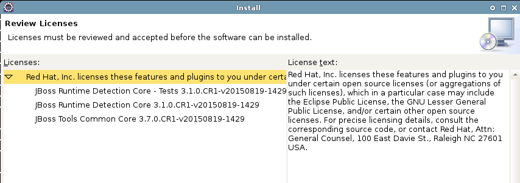
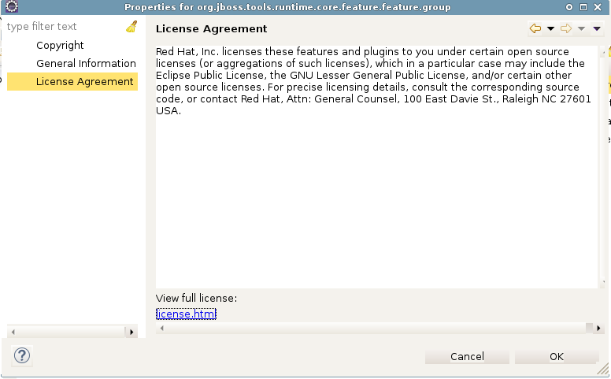
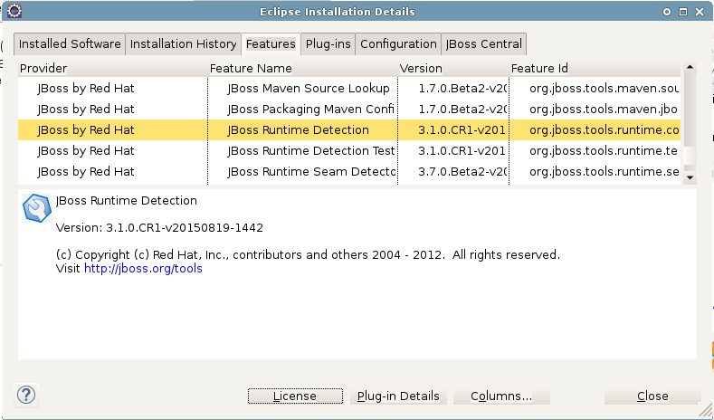
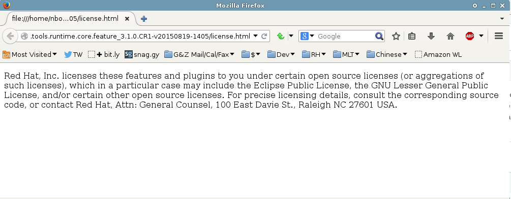

= License features

License features are a new construct introduced for JBoss Tools 4.3. What happens is that the license text normally copied into all your `feature.properties` or `feature.xml` files, then copied again into `license.html` files in your features, is now contained upstream in the org.jboss.tools.foundation.license.feature:

* https://github.com/jbosstools/jbosstools-base/blob/master/foundation/features/org.jboss.tools.foundation.license.feature/feature.properties#L13-19

To use this in your features, so that license changes are a trivial change instead of requiring the update of all your `feature.properties` or `feature.xml` and `license.html` files, there are a few simple steps:

== How to use license features

* Add this to your `feature.xml` files:

```
    license-feature="org.jboss.tools.foundation.license.feature"
    license-feature-version="0.0.0"
```

* If not already there, add this to your `feature.xml` files; add the `url="%licenseURL"` part if not present; this will allow your feature to link to the local license.html file.

```
   <license url="%licenseURL">
      %license
   </license>
```

* Remove all license.html files - these files will be created at build time from the license feature's version of the file

* Edit your `build.properties` files to remove all *references* to `license.html`. You'd think this would fail the build, but Tycho will ensure the file is created from upstream license feature, so all is well. If you *include* the reference to it, the build *will fail* because `build.properties` is read BEFORE Tycho inserts the `license.html` file.

Your `build.properties` file will may depending on what's in your feature. Here's an example of the change you might make:

```
bin.includes = feature.xml,\
-               feature.properties,\
-               license.html
+               feature.properties

-src.includes = license.html
+src.includes = *
```

* Remove definition of `license` from feature.properties

```
    - license=Red Hat, Inc. licenses these features and plugins to you under ...
```

* Add definition of `licenseURL` to feature.properties (if not already there)

```
    + licenseURL=license.html
```

Note: it may seem redundant to use %licenseURL in feature.xml and define it as `licenseURL=license.html`, but this avoids having a non-functional link to `license.html` in `Help -> Installation Details -> Installed Software -> Properties -> License Agreement` (see step 7 below).


== Verify your changes

1. Rebuild your features (eg., with `mvn clean install -DskipTests`

2. Verify new features in the `site/target/repository/features/` folder

3. link:../debugging/how_to_install_a_build.adoc[Install the newly created features] into Eclipse 

4.  During the install, verify that the `Review Licenses` shows the new, updated license. Verify that the features being installed have a visible license with some title text on the left column, and full, new license in the right column.

* 

5. Once the workbench is restarted, select `Help -> Installation Details`

6. On the `Installed Software` tab, select your feature and click `Properties`

7. In the Properties dialog, select `License Agreement` and verify the correct text is there

* 

8. Close the Properties dialog

9. Switch to the `Features` tab and select your feature

* 

10. Click the `License` button, and verify your license appears in an external browser. The path should be something like `file:///path/to/eclipse/features/org.jboss.tools.runtime.core.feature_3.1.0.CR1-v20150819-1405/license.html`

* 

== Examples

* https://github.com/jbosstools/jbosstools-server/pull/365
* https://github.com/jbosstools/jbosstools-base/commit/3db3133fd026233daf4e8765410ca52b03330a3f and https://github.com/jbosstools/jbosstools-base/pull/436

== See also

See also http://help.eclipse.org/mars/index.jsp?topic=%2Forg.eclipse.pde.doc.user%2Ftasks%2Fpde_shared_license.htm
