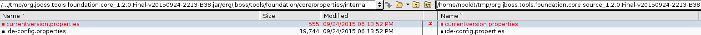
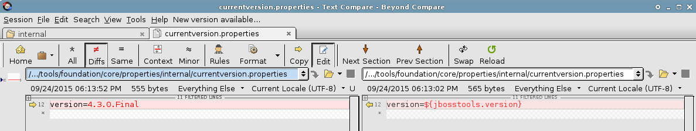

= Versioning rules for build artifacts

This document describes how we handle the versioning of build artifacts in JBoss Tools and Red Hat JBoss Developer Studio.

:toc: macro
toc::[]

There are four major artifacts related to product versioning:

* parent pom (maven artifact)
* org.jboss.tools.foundation.core (plugin)
* com.jboss.devstudio.core.central (plugin)
* ide-config.properties (properties file)

== Parent pom versioning & when to update

Parent pom is updated at the start of every milestone that will become a public published one. This is because the `BUILD_ALIAS` variable in the parent pom controls the suffix used in plugin and feature qualifiers. So for a parent pom version 4.3.0.Beta1, `BUILD_ALIAS` will be Beta1 and thus all plugins and features for that Beta1 release will also have Beta1 in their filenames.

Once the initial x.y.0.Final release is completed, service releases may not require a new parent pom. However, parent pom SHOULD be updated & incremented if a new target platform will be used for future builds. For example, JBoss Tools 4.3.0.Final was built using Eclipse 4.5.1 (Mars.1) but a future JBoss Tools 4.3.x will be built using Eclipse 4.5.2 (Mars.2), so a new target platform, and therefore parent pom, will be needed to ensure all projects within JBoss Tools and JBoss Developer Studio are built using the latest upstream dependencies.

    <TARGET_PLATFORM_VERSION>4.50.0.Final</TARGET_PLATFORM_VERSION>
		<TARGET_PLATFORM_VERSION_MAXIMUM>4.51.0.Final</TARGET_PLATFORM_VERSION_MAXIMUM>

Parent pom also controls a few other important properties, such as the version of Tycho and other release engineering tooling used to build & publish.

		<tychoVersion>0.23.1</tychoVersion>
		<jbossTychoPluginsVersion>0.23.1</jbossTychoPluginsVersion>
		<jbosstoolsRelengPublishVersion>4.3.0.Final</jbosstoolsRelengPublishVersion>

As noted below, the version of the parent pom is used to define the "version" of JBoss Tools for the purpose of controlling downstream version-specific changes, such as which JBoss Central site from which to fetch updates.

== Properties that define what version of JBoss Tools and Red Hat JBoss Developer Studio is running

There are two plugins which control which version of the "product" is running. These are:

* org.jboss.tools.foundation.core
* com.jboss.devstudio.core.central

These plugins inherit their declared versions from the parent pom. This is not the same as their OSGi versions. 

So, for a value of 4.3.0.Final-SNAPSHOT in link:https://github.com/jbosstools/jbosstools-build/blob/jbosstools-4.3.x/parent/pom.xml#L7[parent pom], 
a value of 4.3.0.Final is computed and stored in link:https://github.com/jbosstools/jbosstools-base/blob/jbosstools-4.3.x/foundation/plugins/org.jboss.tools.foundation.core/src/org/jboss/tools/foundation/core/properties/internal/currentversion.properties[org.jboss.tools.foundation.core / currentversion.properties] and 
https://github.com/jbdevstudio/jbdevstudio-product/blob/jbosstools-4.3.x/plugins/com.jboss.devstudio.core.central/src/com/jboss/devstudio/core/internal/properties/currentversion.properties[com.jboss.devstudio.core.central / currentversion.properties].

Addionally, a hard-coded default variable is set there too. This is only used when an install cannot reach the internet to :

    default.version=4.3.0.Beta1
      or
    default.version=9.0.0.GA

But that value is overruled by the value that's added at build time. For example, compare these files:

=== How does this work?

In org.jboss.tools.foundation.core, the value is computed here, based on the version of the parent pom:

	<plugin>
		<groupId>org.codehaus.mojo</groupId>
		<artifactId>build-helper-maven-plugin</artifactId>
		<version>1.9.1</version>
		<executions>
			<execution>
				<phase>validate</phase>
				<id>parse-version</id>
				<goals>
					<goal>parse-version</goal>
				</goals>
				<configuration>
					<versionString>${project.parent.parent.parent.version}</versionString>
				</configuration>
			</execution>
		</executions>
	</plugin>

-- https://github.com/jbosstools/jbosstools-base/blob/jbosstools-4.3.x/foundation/plugins/org.jboss.tools.foundation.core/pom.xml#L26-L43[org.jboss.tools.foundation.core / pom.xml]

	<properties><jbosstools.version>${parsedVersion.majorVersion}.${parsedVersion.minorVersion}.${parsedVersion.incrementalVersion}.${BUILD_ALIAS}</jbosstools.version></properties>

-- https://github.com/jbosstools/jbosstools-base/blob/jbosstools-4.3.x/foundation/plugins/org.jboss.tools.foundation.core/pom.xml#L134[org.jboss.tools.foundation.core / pom.xml]

Similarly for JBoss Developer Studio, it is computed from the version of the root pom:

	<plugin>
		<groupId>org.codehaus.mojo</groupId>
		<artifactId>build-helper-maven-plugin</artifactId>
		<version>1.9.1</version>
		<executions>
			<execution>
				<phase>validate</phase>
				<id>parse-version</id>
				<goals>
					<goal>parse-version</goal>
				</goals>
				<configuration>
					<versionString>${project.version}</versionString>
				</configuration>
			</execution>
		</executions>
	</plugin>

-- https://github.com/jbdevstudio/jbdevstudio-product/blob/jbosstools-4.3.x/pom.xml#L58-L74[jbdevstudio-product / pom.xml]

	<properties><devstudio.version>${parsedVersion.majorVersion}.${parsedVersion.minorVersion}.${parsedVersion.incrementalVersion}.${BUILD_ALIAS}</devstudio.version></properties>

-- https://github.com/jbdevstudio/jbdevstudio-product/blob/jbosstools-4.3.x/pom.xml#L50[jbdevstudio-product / pom.xml]

=== How do we ensure we have the correct value of default.version in o.j.t.foundation.core & c.j.d.central.core's currentversion.properties?

There is currently no tool that checks for the value of `default.version`. However, there is a script for verifying that the `version` variable is correctly set. Here's how that works:

* link:https://github.com/jbdevstudio/jbdevstudio-devdoc/blob/master/release_guide/9.x/JBT_Staging_for_QE.adoc#verify-correct-version-set-in-orgjbosstoolsfoundationcore[JBT Staging]
* link:https://github.com/jbdevstudio/jbdevstudio-devdoc/blob/master/release_guide/9.x/JBDS_Staging_for_QE.adoc#verify-correct-version-set-in-comjbossdevstudiocentralcore[JBDS Staging]

   
== ide-config.properties versioning & when to update

https://github.com/jbosstools/jbosstools-download.jboss.org/blob/master/jbosstools/configuration/ide-config.properties[ide-config.properties] is split into two major sections: properties for JBoss Tools, and properties for JBoss Developer Studio.

Within each section are blocks of properties for each current stable and/or development milestone release, each staging build, and nightly CI builds. This allows any user, depending on the value of `version` set in the org.jboss.tools.foundation.core or com.jboss.devstudio.core.central of their install, to see the CORRECT version of Central for that install.

Thus, for JBoss Tools 4.3.0.Final users, or anyone using a stable release of 4.3.x:

	jboss.discovery.directory.url|jbosstools|4.3=http://download.jboss.org/jbosstools/mars/stable/updates/discovery.earlyaccess/4.3.0.Final/jbosstools-directory.xml
	jboss.discovery.site.url|jbosstools|4.3=http://download.jboss.org/jbosstools/mars/stable/updates/
	jboss.discovery.earlyaccess.site.url|jbosstools|4.3=http://download.jboss.org/jbosstools/mars/stable/updates/earlyaccess/
	jboss.discovery.earlyaccess.list.url|jbosstools|4.3=http://download.jboss.org/jbosstools/mars/stable/updates/discovery.earlyaccess/4.3.0.Final/jbosstools-earlyaccess.properties

	# JBTIS content should be composited into the JBT site
	jboss.discovery.site.integration-stack.url|jbosstools|4.3=http://download.jboss.org/jbosstools/mars/stable/updates/
	jboss.discovery.earlyaccess.site.integration-stack.url|jbosstools|4.3=http://download.jboss.org/jbosstools/mars/development/updates/
	jboss.discovery.site.integration-stack-sap.url|jbosstools|4.3=http://download.jboss.org/jbosstools/mars/development/updates/integration-stack/extras/jboss-fuse-sap-tool-suite/8.0.0.Alpha1/all/

To cause users to see a different Central site, they need only install a newer version which references a more specific version than `4.3`. For example, this would work for anyone running a pre-released nightly of JBoss Tools 4.3.1.CR1:

	jboss.discovery.directory.url|jbosstools|4.3.1.CR1=http://download.jboss.org/jbosstools/mars/snapshots/builds/jbosstools-discovery.earlyaccess_4.3.mars/latest/all/repo/jbosstools-directory.xml
	jboss.discovery.site.url|jbosstools|4.3.1.CR1=http://download.jboss.org/jbosstools/mars/snapshots/builds/jbosstools-discovery.central_4.3.mars/latest/all/repo/

When it's time to stage that nightly CI build for QE & CAT testing, the bits are copied to another location and those properties are commented out. Instead, this is enabled:

	#jboss.discovery.directory.url|jbosstools|4.3.1.CR1=http://download.jboss.org/jbosstools/mars/staging/updates/discovery.earlyaccess/4.3.1.CR1/jbosstools-directory.xml
	#jboss.discovery.site.url|jbosstools|4.3.1.CR1=http://download.jboss.org/jbosstools/mars/staging/updates/

Once a release train is at end of life, there will only be one set of properties for that release. Thus, for all current and future JBoss Tools 4.2.x builds, there is currently only one set of properties, keyed to version = 4.2:

	jboss.discovery.directory.url|jbosstools|4.2=http://download.jboss.org/jbosstools/updates/stable/luna/jbosstools-directory.xml
	jboss.discovery.site.url|jbosstools|4.2=http://download.jboss.org/jbosstools/updates/stable/luna/
	jboss.discovery.earlyaccess.site.url|jbosstools|4.2=http://download.jboss.org/jbosstools/earlyaccess/stable/luna/
	jboss.discovery.earlyaccess.list.url|jbosstools|4.2=http://download.jboss.org/jbosstools/updates/stable/luna/jbosstools-earlyaccess.properties
	jboss.discovery.site.integration-stack.url|jbosstools|4.2=http://download.jboss.org/jbosstools/discovery/stable/integration-stack/
	jboss.discovery.earlyaccess.site.integration-stack.url|jbosstools|4.2=http://download.jboss.org/jbosstools/discovery/stable/integration-stack/earlyaccess/
	jboss.discovery.site.integration-stack-sap.url|jbosstools|4.2=http://download.jboss.org/jbosstools/updates/stable/luna/integration-stack/extras/

